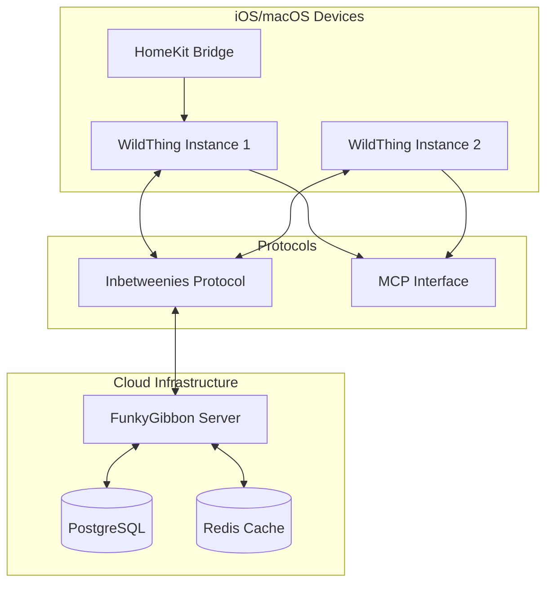

<!--
The Goodies - System Architecture Documentation

DEVELOPMENT CONTEXT:
Originally created as a comprehensive distributed smart home system with
multiple houses and complex synchronization. Later simplified to focus on
single-house deployments with SQLite and last-write-wins conflict resolution.

DOCUMENT PURPOSE:
Provides the high-level system architecture and design decisions for The
Goodies smart home knowledge graph system. Serves as the primary technical
reference for understanding system components and their interactions.

REVISION HISTORY:
- 2024-01-10: Initial architecture for distributed multi-house system
- 2024-01-15: Simplified to single-house deployment with SQLite
- 2024-01-15: Added Blowing-Off test client to architecture

CURRENT STATUS:
This document reflects the ORIGINAL ambitious architecture. The actual
implementation has been significantly simplified. See simplified-requirements.md
for the current scope.
-->

# The Goodies - System Architecture Specification

## Executive Summary

The Goodies is a distributed smart home knowledge graph system consisting of three core components:

1. **WildThing** - A Swift Package providing an MCP server for knowledge graph operations
2. **FunkyGibbon** - A Python backend service for centralized data synchronization
3. **Inbetweenies** - A bidirectional sync protocol for distributed data consistency

This architecture enables local-first smart home management with optional cloud synchronization, supporting offline operation while maintaining eventual consistency across devices.

## System Overview



## Core Architectural Principles

### 1. Local-First Design
- **Primary Storage**: SQLite on each device
- **Offline Operation**: Full functionality without network
- **Sync Optional**: Cloud sync enhances but doesn't require connectivity

### 2. Event Sourcing
- **Immutable Events**: All changes stored as versioned entities
- **Full History**: Complete audit trail of modifications
- **Time Travel**: Ability to view state at any point in time

### 3. Eventual Consistency
- **Vector Clocks**: Track causal ordering of changes
- **Conflict Resolution**: Automatic and manual strategies
- **Multi-Master**: Any device can make changes

### 4. Protocol-First
- **MCP Standard**: Model Context Protocol for AI integration
- **Inbetweenies**: Custom sync protocol for distributed consistency
- **Platform Agnostic**: Clean interfaces between components

## Component Architecture

### WildThing (Swift Package)

```
WildThing/
├── Core/                    # Platform-agnostic core
│   ├── Models/             # Entity and relationship models
│   ├── Protocols/          # WildThingEntity, Storage protocols
│   └── Extensions/         # Utility extensions
├── Storage/                # Persistence layer
│   ├── SQLiteStorage.swift # SQLite implementation
│   ├── MemoryStorage.swift # In-memory for testing
│   └── StorageProtocol.swift
├── Graph/                  # Graph operations
│   ├── HomeGraph.swift     # Main graph interface
│   ├── Traversal.swift     # Path finding algorithms
│   └── Search.swift        # Search and indexing
├── MCP/                    # MCP server implementation
│   ├── WildThingMCPServer.swift
│   ├── Tools/              # MCP tool implementations
│   └── Handlers/           # Request handlers
├── Inbetweenies/          # Sync protocol
│   ├── SyncManager.swift   # Sync orchestration
│   ├── ConflictResolver.swift
│   └── NetworkService.swift
└── Platform/              # Platform-specific code
    ├── iOS/               # iOS-specific features
    ├── macOS/             # macOS-specific features
    └── HomeKit/           # HomeKit integration
```

### FunkyGibbon (Python Service)

```
funkygibbon/
├── core/                   # Core business logic
│   ├── models.py          # Pydantic models
│   ├── entities.py        # Entity management
│   └── relationships.py   # Relationship logic
├── storage/               # Data persistence
│   ├── postgresql.py      # PostgreSQL adapter
│   ├── redis_cache.py     # Redis caching
│   └── migrations/        # Database migrations
├── inbetweenies/         # Sync protocol
│   ├── sync_service.py    # Sync handler
│   ├── vector_clock.py    # Vector clock implementation
│   └── conflict_resolution.py
├── api/                   # REST API
│   ├── main.py           # FastAPI app
│   ├── routes/           # API endpoints
│   └── middleware/       # Auth, logging, etc.
└── mcp/                   # MCP compatibility
    ├── server.py         # MCP server wrapper
    └── tools.py          # Tool implementations
```

### Inbetweenies Protocol

```
Inbetweenies/
├── protocol-spec.md       # Protocol specification
├── schemas/              # JSON Schema definitions
│   ├── sync-request.json
│   ├── sync-response.json
│   ├── entity-change.json
│   └── vector-clock.json
├── examples/             # Example messages
└── test-vectors/         # Test data for implementations
```

## Data Model Architecture

### Entity Model

```typescript
interface WildThingEntity {
    id: string                    // UUID
    version: string              // Timestamp-based version
    entityType: EntityType       // home, room, device, etc.
    parentVersions: string[]     // For conflict detection
    content: Map<string, any>    // Flexible content storage
    userId: string              // Owner identification
    sourceType: SourceType      // homekit, manual, etc.
    createdAt: Date
    lastModified: Date
}

enum EntityType {
    HOME, ROOM, DEVICE, ACCESSORY, SERVICE,
    ZONE, DOOR, WINDOW, PROCEDURE, MANUAL,
    NOTE, SCHEDULE, AUTOMATION
}
```

### Relationship Model

```typescript
interface EntityRelationship {
    id: string
    fromEntityId: string
    toEntityId: string
    relationshipType: RelationshipType
    properties: Map<string, any>
    userId: string
    createdAt: Date
}

enum RelationshipType {
    LOCATED_IN,      // Device in Room
    CONTROLS,        // Switch controls Light
    CONNECTS_TO,     // Room to Room via Door
    PART_OF,         // Service part of Device
    MANAGES,         // Automation manages Device
    DOCUMENTED_BY,   // Device documented by Manual
    PROCEDURE_FOR,   // Procedure for Device
    TRIGGERED_BY,    // Automation triggered by Event
    DEPENDS_ON       // Entity depends on another
}
```

## Storage Architecture

### SQLite Schema (WildThing)

```sql
-- Core entities table with versioning
CREATE TABLE entities (
    id TEXT NOT NULL,
    version TEXT NOT NULL,
    entity_type TEXT NOT NULL,
    parent_versions TEXT,  -- JSON array
    content TEXT NOT NULL, -- JSON object
    user_id TEXT NOT NULL,
    source_type TEXT NOT NULL,
    created_at INTEGER NOT NULL,
    last_modified INTEGER NOT NULL,
    PRIMARY KEY (id, version)
);

-- Relationships between entities
CREATE TABLE relationships (
    id TEXT PRIMARY KEY,
    from_entity_id TEXT NOT NULL,
    to_entity_id TEXT NOT NULL,
    relationship_type TEXT NOT NULL,
    properties TEXT,      -- JSON object
    user_id TEXT NOT NULL,
    created_at INTEGER NOT NULL,
    FOREIGN KEY (from_entity_id) REFERENCES entities(id),
    FOREIGN KEY (to_entity_id) REFERENCES entities(id)
);

-- Binary content storage
CREATE TABLE binary_content (
    id TEXT PRIMARY KEY,
    entity_id TEXT NOT NULL,
    entity_version TEXT NOT NULL,
    content_type TEXT NOT NULL,
    file_name TEXT,
    data BLOB NOT NULL,
    checksum TEXT NOT NULL,
    created_at INTEGER NOT NULL,
    FOREIGN KEY (entity_id, entity_version) 
        REFERENCES entities(id, version)
);

-- Sync metadata
CREATE TABLE sync_metadata (
    key TEXT PRIMARY KEY,
    value TEXT NOT NULL,
    updated_at INTEGER NOT NULL
);

-- Indices for performance
CREATE INDEX idx_entities_type ON entities(entity_type);
CREATE INDEX idx_entities_modified ON entities(last_modified);
CREATE INDEX idx_entities_latest ON entities(id, created_at DESC);
CREATE INDEX idx_relationships_from ON relationships(from_entity_id);
CREATE INDEX idx_relationships_to ON relationships(to_entity_id);
CREATE INDEX idx_relationships_type ON relationships(relationship_type);
```

### PostgreSQL Schema (FunkyGibbon)

```sql
-- Extended schema for server-side storage
CREATE TABLE entities (
    id UUID PRIMARY KEY DEFAULT gen_random_uuid(),
    version TEXT NOT NULL,
    entity_type VARCHAR(50) NOT NULL,
    parent_versions JSONB DEFAULT '[]',
    content JSONB NOT NULL,
    user_id UUID NOT NULL,
    source_type VARCHAR(50) NOT NULL,
    created_at TIMESTAMPTZ DEFAULT NOW(),
    last_modified TIMESTAMPTZ DEFAULT NOW(),
    deleted_at TIMESTAMPTZ,  -- Soft delete support
    UNIQUE(id, version)
);

-- Vector clock for distributed sync
CREATE TABLE vector_clocks (
    user_id UUID NOT NULL,
    device_id TEXT NOT NULL,
    clock_value TEXT NOT NULL,
    updated_at TIMESTAMPTZ DEFAULT NOW(),
    PRIMARY KEY (user_id, device_id)
);

-- Conflict tracking
CREATE TABLE conflicts (
    id UUID PRIMARY KEY DEFAULT gen_random_uuid(),
    entity_id UUID NOT NULL,
    local_version TEXT NOT NULL,
    remote_version TEXT NOT NULL,
    conflict_type VARCHAR(50) NOT NULL,
    resolution_status VARCHAR(50) DEFAULT 'pending',
    resolved_at TIMESTAMPTZ,
    resolved_by UUID,
    created_at TIMESTAMPTZ DEFAULT NOW()
);

-- Audit log for compliance
CREATE TABLE audit_log (
    id BIGSERIAL PRIMARY KEY,
    entity_id UUID,
    action VARCHAR(50) NOT NULL,
    user_id UUID NOT NULL,
    device_id TEXT,
    changes JSONB,
    timestamp TIMESTAMPTZ DEFAULT NOW()
);
```

## Security Architecture

### Authentication & Authorization

```yaml
Authentication:
  - Device-based: Unique device IDs with certificates
  - User-based: OAuth2/OIDC integration
  - API Keys: For server-to-server communication

Authorization:
  - Role-Based Access Control (RBAC)
  - Entity-level permissions
  - Operation-level restrictions

Encryption:
  - Transport: TLS 1.3 minimum
  - At-rest: SQLite encryption extension
  - End-to-end: Optional for sensitive data
```

### Data Privacy

1. **Local-First**: Primary data stays on device
2. **Minimal Sync**: Only sync what's necessary
3. **User Control**: Full data export/delete capabilities
4. **Audit Trail**: Complete history of access

## Performance Architecture

### Optimization Strategies

1. **Caching Layers**
   - In-memory graph cache (WildThing)
   - Redis cache (FunkyGibbon)
   - SQLite query result cache

2. **Indexing**
   - Full-text search indices
   - Graph traversal optimization
   - Relationship lookups

3. **Batching**
   - Bulk entity operations
   - Batched sync requests
   - Aggregated notifications

### Performance Targets

```yaml
Local Operations:
  - Entity lookup: < 1ms
  - Graph traversal: < 10ms
  - Search: < 50ms
  - Bulk import: > 1000 entities/second

Sync Operations:
  - Delta sync: < 2 seconds
  - Full sync: < 30 seconds
  - Conflict resolution: < 100ms/conflict

Memory Usage:
  - Base: < 50MB
  - Per 1000 entities: ~10MB
  - Maximum recommended: 500MB
```

## Scalability Architecture

### Horizontal Scaling (FunkyGibbon)

```yaml
Load Balancing:
  - Geographic distribution
  - Session affinity for sync
  - Health check endpoints

Database Sharding:
  - User-based sharding
  - Geographic sharding
  - Read replicas for queries

Caching Strategy:
  - Redis cluster
  - CDN for static content
  - Edge caching for API
```

### Vertical Scaling (WildThing)

```yaml
Resource Management:
  - Lazy loading of entities
  - Pagination for large results
  - Memory-mapped files for large datasets

Background Processing:
  - Async indexing
  - Deferred sync
  - Batch operations
```

## Integration Architecture

### HomeKit Integration

```swift
// HomeKit Bridge Architecture
class HomeKitBridge {
    private let storage: WildThingStorage
    private let homeManager: HMHomeManager
    
    func importHome(_ home: HMHome) async throws {
        // Convert HMHome to HomeEntity
        let homeEntity = HomeEntity(
            entityType: .home,
            content: [
                "name": home.name,
                "uniqueIdentifier": home.uniqueIdentifier.uuidString
            ],
            userId: getCurrentUserId(),
            sourceType: .homekit
        )
        
        // Import rooms, accessories, etc.
        for room in home.rooms {
            await importRoom(room, homeId: homeEntity.id)
        }
    }
}
```

### Matter/Thread Support

```python
# Matter Device Integration
class MatterBridge:
    def import_matter_device(self, device: MatterDevice) -> HomeEntity:
        return HomeEntity(
            entity_type=EntityType.DEVICE,
            content={
                "name": device.name,
                "vendorId": device.vendor_id,
                "productId": device.product_id,
                "capabilities": device.get_capabilities()
            },
            source_type=SourceType.MATTER
        )
```

## Deployment Architecture

### WildThing Deployment

```yaml
iOS/macOS App:
  - Embedded framework
  - App Group for data sharing
  - Background sync capability

Swift Package:
  - SPM distribution
  - Semantic versioning
  - Binary framework option
```

### FunkyGibbon Deployment

```yaml
Container Architecture:
  - Docker containers
  - Kubernetes orchestration
  - Auto-scaling policies

Infrastructure:
  - AWS/GCP/Azure support
  - Managed PostgreSQL
  - Redis ElastiCache
  - CDN distribution
```

## Monitoring & Observability

### Metrics Collection

```yaml
Application Metrics:
  - Entity count by type
  - Sync frequency and duration
  - Conflict rate
  - API response times

System Metrics:
  - CPU/Memory usage
  - Database connections
  - Cache hit rates
  - Network latency

Business Metrics:
  - Active users
  - Devices per user
  - Feature usage
  - Error rates
```

### Logging Architecture

```yaml
Structured Logging:
  - JSON format
  - Correlation IDs
  - User/Device context
  - Performance traces

Log Aggregation:
  - ELK Stack or similar
  - Real-time alerting
  - Historical analysis
  - Compliance archival
```

## Disaster Recovery

### Backup Strategy

```yaml
Local (WildThing):
  - Automatic SQLite backups
  - iCloud backup integration
  - Export to JSON/Archive

Server (FunkyGibbon):
  - Continuous PostgreSQL replication
  - Point-in-time recovery
  - Geographic redundancy
  - Regular backup testing
```

### Recovery Procedures

1. **Device Loss**: Restore from cloud sync
2. **Server Failure**: Failover to replica
3. **Data Corruption**: Restore from backups
4. **Sync Conflicts**: Manual resolution UI

## Future Architecture Considerations

### Phase 2 Enhancements

1. **GraphQL API**: Alternative to REST
2. **WebSocket Sync**: Real-time updates
3. **Edge Computing**: Local AI inference
4. **Blockchain**: Decentralized trust

### Extensibility Points

1. **Plugin System**: Third-party integrations
2. **Custom Entities**: User-defined types
3. **Workflow Engine**: Automation rules
4. **AI Assistant**: Natural language queries

## Architecture Decision Records (ADRs)

### ADR-001: SQLite for Local Storage
- **Status**: Accepted
- **Context**: Need reliable, embedded database
- **Decision**: Use SQLite with custom schema
- **Consequences**: Simple deployment, good performance, limited concurrent writes

### ADR-002: Inbetweenies Protocol
- **Status**: Accepted
- **Context**: Need custom sync protocol
- **Decision**: Create Inbetweenies for bidirectional sync
- **Consequences**: Full control, optimized for use case, maintenance burden

### ADR-003: MCP Integration
- **Status**: Accepted
- **Context**: AI tool integration requirement
- **Decision**: Implement MCP server in both components
- **Consequences**: AI-ready, standard interface, additional complexity

## Conclusion

This architecture provides a robust foundation for a distributed smart home knowledge graph system. The local-first approach ensures reliability and privacy, while the optional cloud sync enables multi-device scenarios. The clean separation between WildThing, FunkyGibbon, and Inbetweenies allows independent evolution while maintaining interoperability.

Key architectural benefits:
- **Reliability**: Offline-first with eventual consistency
- **Privacy**: Data stays local by default
- **Extensibility**: Clean interfaces and plugin points
- **Performance**: Optimized for typical usage patterns
- **Standards**: MCP compliance for AI integration