# The Goodies - Architecture Diagrams

## System Architecture Overview

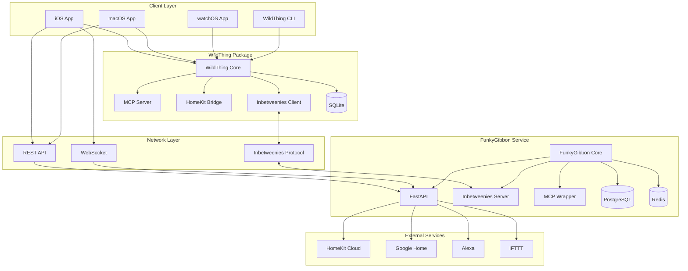

## Data Flow Architecture

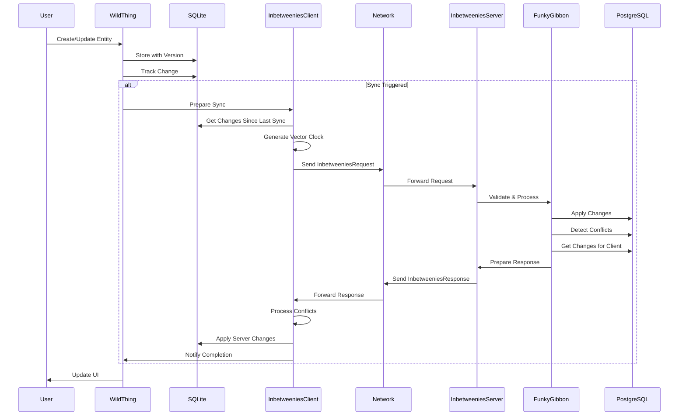

## Component Architecture

### WildThing Internal Architecture

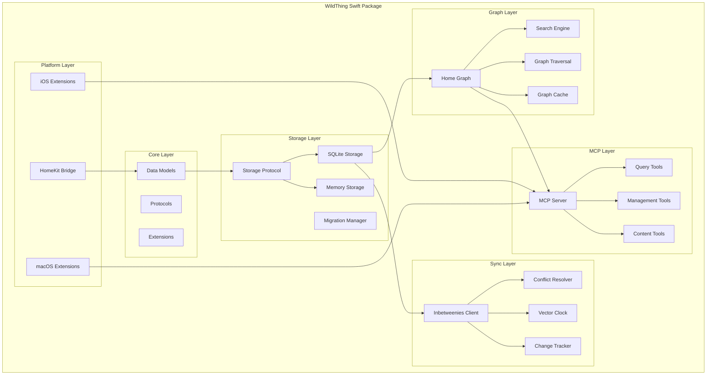

### FunkyGibbon Internal Architecture

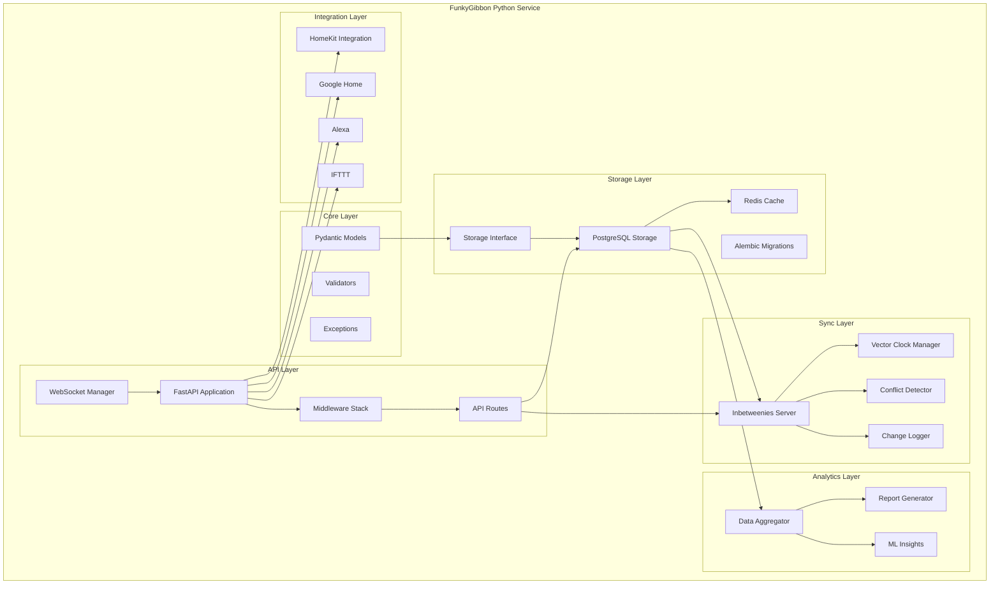

## Inbetweenies Protocol Flow

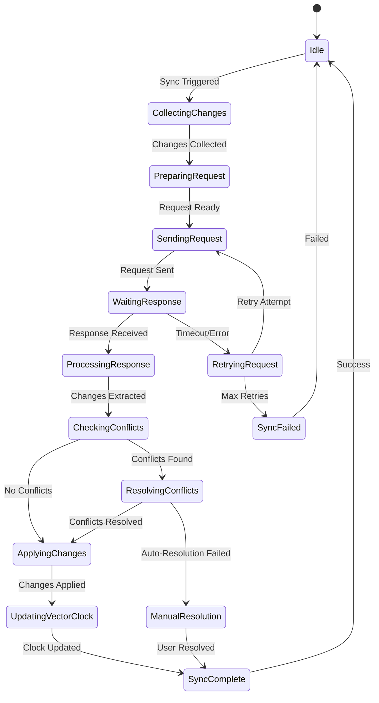

## Security Architecture

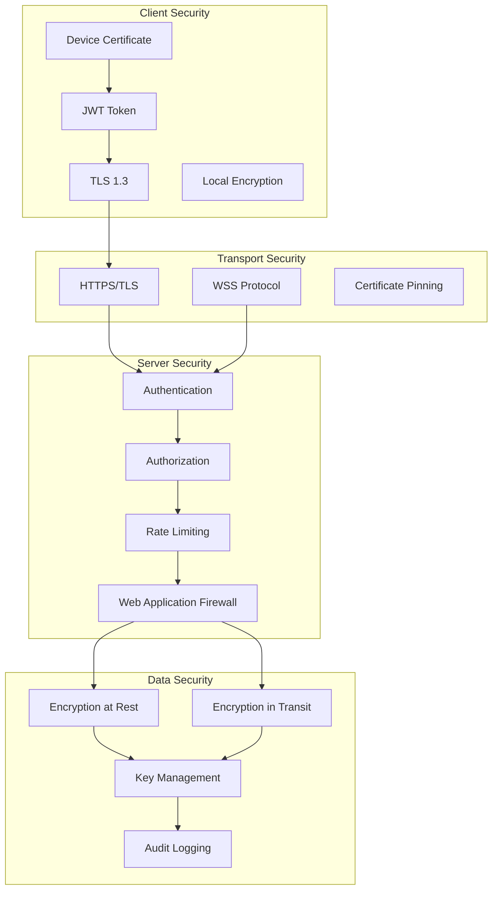

## Deployment Architecture

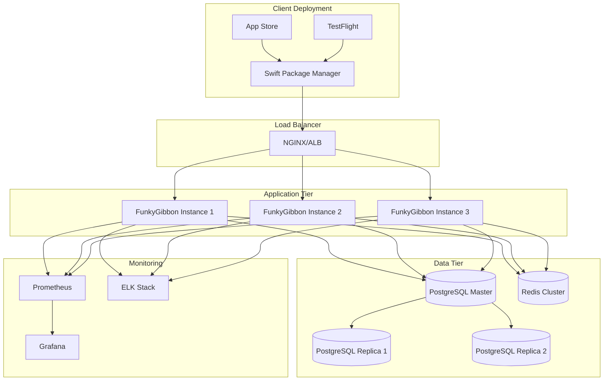

## Storage Schema Relationships

```mermaid
erDiagram
    ENTITIES ||--o{ ENTITY_VERSIONS : has
    ENTITIES ||--o{ RELATIONSHIPS : from
    ENTITIES ||--o{ RELATIONSHIPS : to
    ENTITIES ||--o{ BINARY_CONTENT : contains
    ENTITIES ||--o{ ENTITY_CHANGES : tracks
    
    ENTITIES {
        uuid id PK
        string current_version
        string entity_type
        string user_id
        timestamp created_at
        timestamp deleted_at
    }
    
    ENTITY_VERSIONS {
        uuid entity_id FK
        string version PK
        json parent_versions
        json content
        string source_type
        timestamp created_at
        timestamp last_modified
    }
    
    RELATIONSHIPS {
        uuid id PK
        uuid from_entity_id FK
        uuid to_entity_id FK
        string relationship_type
        json properties
        string user_id
        timestamp created_at
        timestamp deleted_at
    }
    
    BINARY_CONTENT {
        uuid id PK
        uuid entity_id FK
        string entity_version FK
        string content_type
        string file_name
        blob data
        string checksum
        timestamp created_at
    }
    
    ENTITY_CHANGES {
        bigint id PK
        string change_type
        uuid entity_id
        string entity_version
        json content
        string device_id
        string user_id
        timestamp timestamp
    }
    
    VECTOR_CLOCKS {
        string user_id PK
        string device_id PK
        string clock_value
        timestamp updated_at
    }
    
    SYNC_CONFLICTS {
        uuid id PK
        uuid entity_id
        string local_version
        string remote_version
        string conflict_type
        json conflict_data
        string resolution_status
        timestamp created_at
    }
```

## Performance Architecture

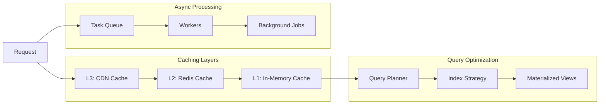

## Real-time Updates Architecture

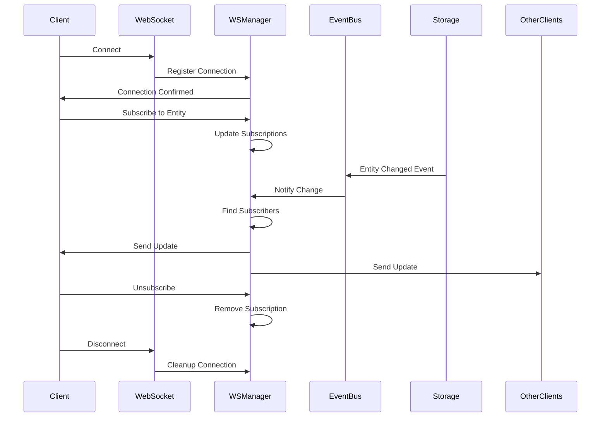

## Error Handling Flow

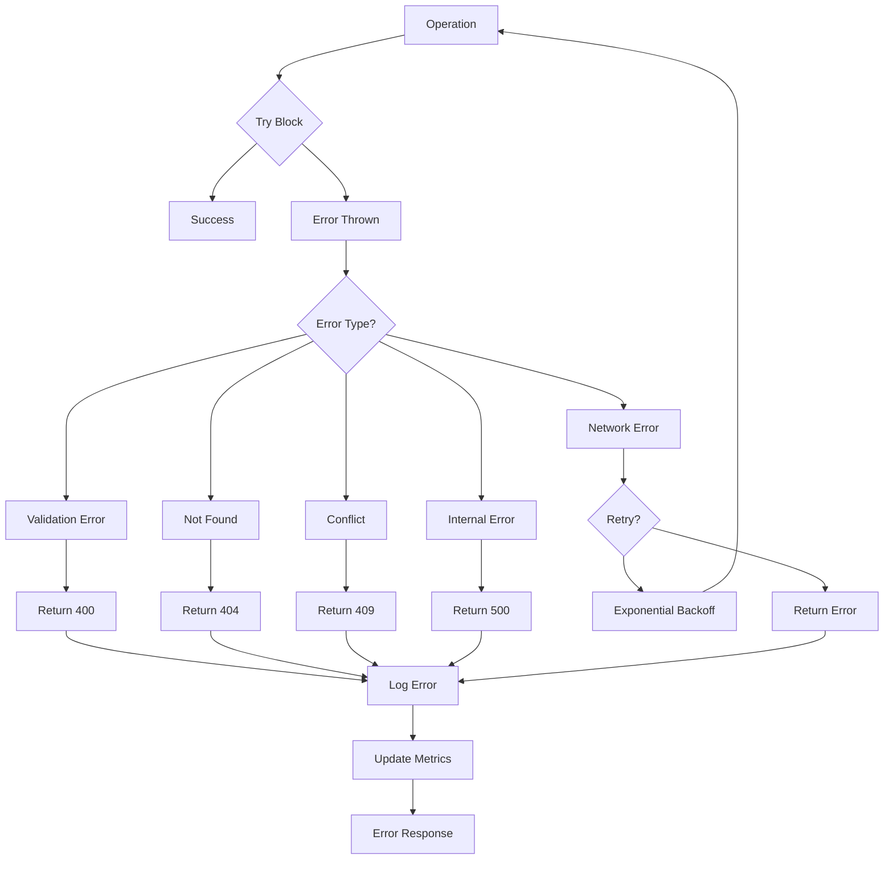

## Migration Architecture

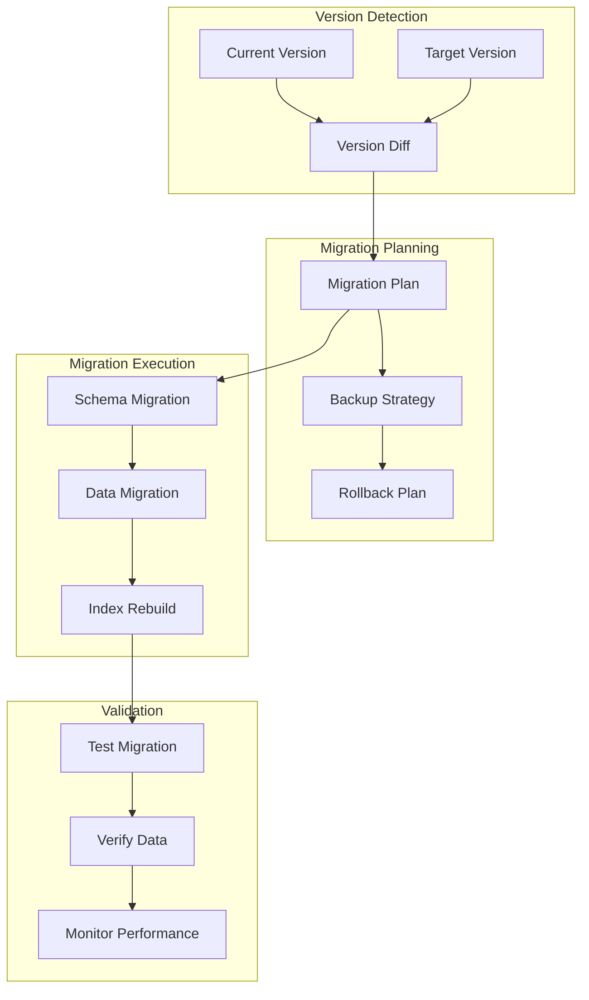

## Monitoring Dashboard Layout

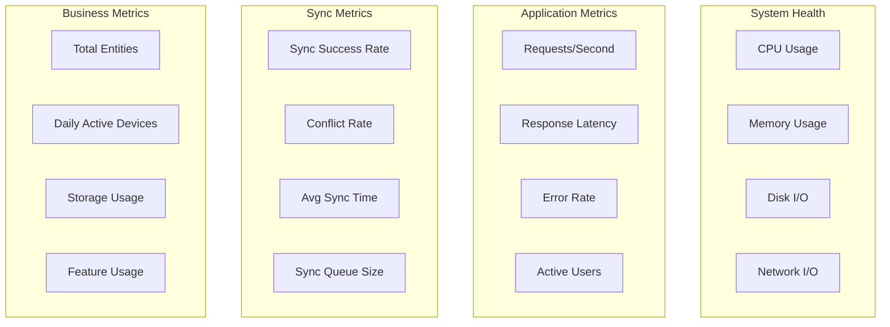

## Conclusion

These architectural diagrams provide a comprehensive view of The Goodies system architecture, showing:

1. **System Overview**: How components interact at a high level
2. **Data Flow**: The lifecycle of data through the system
3. **Component Details**: Internal architecture of major components
4. **Protocol Flow**: State machine for the Inbetweenies protocol
5. **Security Layers**: Defense in depth approach
6. **Deployment Strategy**: Production deployment architecture
7. **Database Schema**: Entity relationships
8. **Performance Optimization**: Caching and optimization strategies
9. **Real-time Updates**: WebSocket communication flow
10. **Error Handling**: Comprehensive error management
11. **Migration Process**: Safe upgrade procedures
12. **Monitoring Layout**: Key metrics to track

Each diagram focuses on a specific aspect while maintaining consistency with the overall architecture.