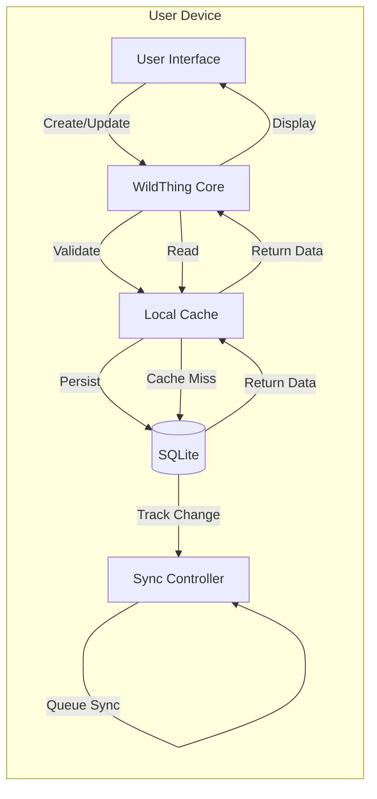
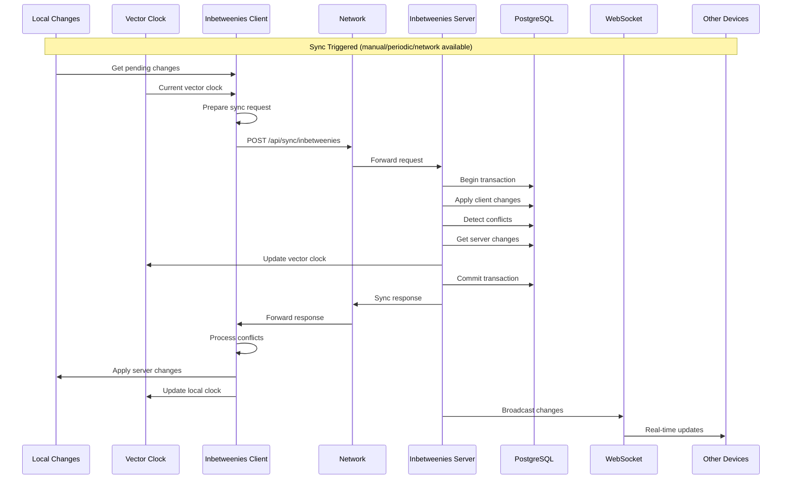
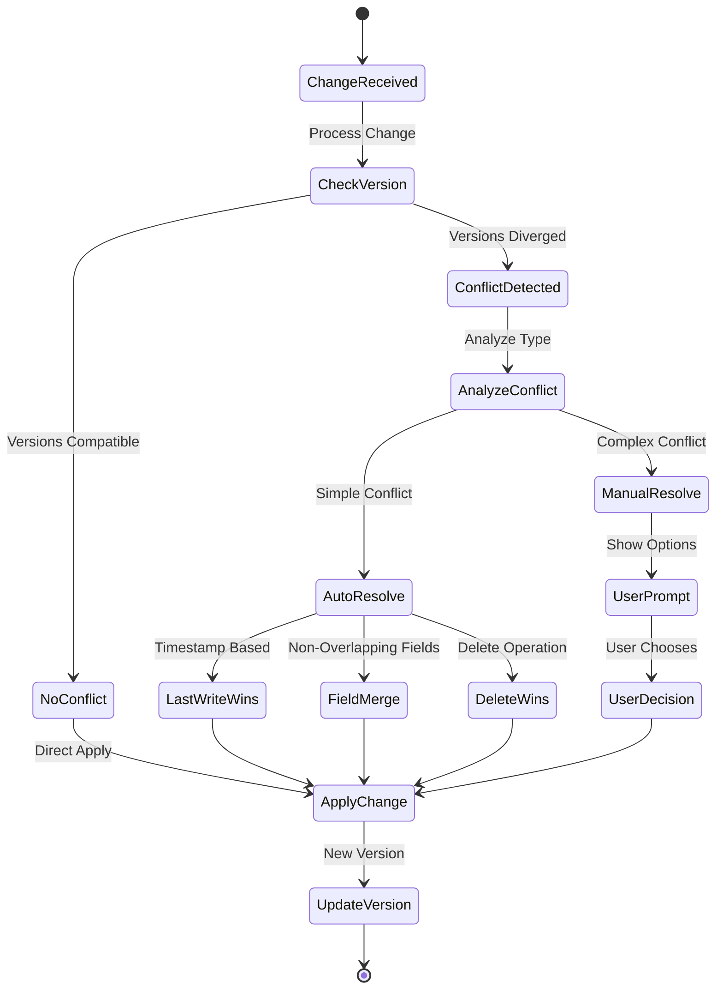

# Data Flow and Synchronization Specification

## Overview

This document describes the detailed data flow patterns and synchronization mechanisms in The Goodies ecosystem, covering how data moves between WildThing clients and FunkyGibbon servers using the Inbetweenies protocol.

## Data Flow Patterns

### 1. Local-First Data Flow



**Key Principles:**
- All operations work offline
- Immediate UI feedback
- Background synchronization
- Optimistic updates with rollback capability

### 2. Synchronization Flow



### 3. Conflict Resolution Flow



## Data Models and Versioning

### Version String Format

```
{timestamp}-{device_id}-{sequence}

Example: 2024-01-15T10:30:00.123Z-device123-001
```

Components:
- **timestamp**: ISO 8601 with milliseconds
- **device_id**: Unique device identifier
- **sequence**: Incrementing counter per device

### Entity Lifecycle

```mermaid
graph TB
    subgraph "Creation"
        New[New Entity] --> V1[Version 1]
        V1 --> Store[Store Locally]
        Store --> Queue[Queue for Sync]
    end
    
    subgraph "Modification"
        Load[Load Entity] --> Modify[Modify Content]
        Modify --> V2[Version 2]
        V2 --> Parent[Parent: Version 1]
        Parent --> Store2[Store Version 2]
    end
    
    subgraph "Synchronization"
        Local[Local Versions] --> Compare[Compare with Server]
        Server[Server Versions] --> Compare
        Compare --> Merge[Merge if Needed]
        Merge --> V3[Version 3]
        V3 --> Parents[Parents: V1, V2]
    end
    
    subgraph "Deletion"
        Delete[Soft Delete] --> VD[Deletion Version]
        VD --> Tombstone[Mark as Deleted]
        Tombstone --> Sync[Sync Deletion]
    end
```



### Change Tracking

```sql
-- Entity changes are tracked automatically
CREATE TRIGGER track_entity_changes
AFTER INSERT OR UPDATE OR DELETE ON entities
FOR EACH ROW EXECUTE FUNCTION record_change();

-- Change log structure
CREATE TABLE entity_changes (
    id BIGSERIAL PRIMARY KEY,
    change_type ENUM('create', 'update', 'delete'),
    entity_id UUID NOT NULL,
    entity_version TEXT NOT NULL,
    old_content JSONB,
    new_content JSONB,
    device_id TEXT NOT NULL,
    timestamp TIMESTAMPTZ DEFAULT NOW(),
    synced BOOLEAN DEFAULT FALSE
);
```

## Synchronization Strategies

### 1. Periodic Sync

```typescript
class PeriodicSyncStrategy {
    private syncInterval = 5 * 60 * 1000; // 5 minutes
    private timer: Timer;
    
    start() {
        this.timer = setInterval(async () => {
            if (await this.shouldSync()) {
                await this.performSync();
            }
        }, this.syncInterval);
    }
    
    async shouldSync(): boolean {
        return (
            this.hasNetwork() &&
            this.hasPendingChanges() &&
            !this.isSyncing()
        );
    }
}
```

### 2. Trigger-Based Sync

```typescript
class TriggerBasedSync {
    private triggers = [
        'network_available',
        'app_foreground',
        'significant_change',
        'user_request'
    ];
    
    setupTriggers() {
        this.triggers.forEach(trigger => {
            eventBus.on(trigger, () => this.checkAndSync());
        });
    }
    
    async checkAndSync() {
        const changeCount = await this.getPendingChangeCount();
        
        if (changeCount > 0) {
            if (changeCount > 100 || this.hasHighPriorityChange()) {
                await this.syncImmediately();
            } else {
                await this.scheduleSync(30); // 30 seconds
            }
        }
    }
}
```

### 3. Real-time Sync

```typescript
class RealtimeSync {
    private websocket: WebSocket;
    private reconnectDelay = 1000;
    
    connect() {
        this.websocket = new WebSocket('wss://funkygibbon.com/ws');
        
        this.websocket.on('open', () => {
            this.authenticate();
            this.subscribeToChanges();
        });
        
        this.websocket.on('message', async (data) => {
            const change = JSON.parse(data);
            await this.handleRealtimeChange(change);
        });
        
        this.websocket.on('close', () => {
            setTimeout(() => this.connect(), this.reconnectDelay);
            this.reconnectDelay = Math.min(this.reconnectDelay * 2, 30000);
        });
    }
    
    async handleRealtimeChange(change: EntityChange) {
        // Skip if change originated from this device
        if (change.device_id === this.deviceId) return;
        
        // Apply change immediately
        await this.applyChange(change);
        
        // Update UI
        this.notifyUI(change);
    }
}
```

## Vector Clock Implementation

### Vector Clock Structure

```typescript
interface VectorClock {
    clocks: Map<string, ClockEntry>;
}

interface ClockEntry {
    deviceId: string;
    timestamp: Date;
    sequence: number;
    version: string;
}

class VectorClockManager {
    private clock: VectorClock;
    
    increment(deviceId: string): string {
        const entry = this.clock.clocks.get(deviceId) || {
            deviceId,
            timestamp: new Date(),
            sequence: 0,
            version: ''
        };
        
        entry.sequence++;
        entry.timestamp = new Date();
        entry.version = this.generateVersion(entry);
        
        this.clock.clocks.set(deviceId, entry);
        return entry.version;
    }
    
    merge(otherClock: VectorClock) {
        for (const [deviceId, otherEntry] of otherClock.clocks) {
            const ourEntry = this.clock.clocks.get(deviceId);
            
            if (!ourEntry || this.compareVersions(otherEntry, ourEntry) > 0) {
                this.clock.clocks.set(deviceId, otherEntry);
            }
        }
    }
    
    happensBefore(other: VectorClock): boolean {
        // Check if all our clocks are <= other's clocks
        for (const [deviceId, ourEntry] of this.clock.clocks) {
            const otherEntry = other.clocks.get(deviceId);
            if (!otherEntry || this.compareVersions(ourEntry, otherEntry) > 0) {
                return false;
            }
        }
        return true;
    }
    
    areConcurrent(other: VectorClock): boolean {
        return !this.happensBefore(other) && !other.happensBefore(this);
    }
}
```

### Conflict Detection Algorithm

```typescript
class ConflictDetector {
    detectConflict(
        localEntity: Entity,
        remoteChange: EntityChange
    ): Conflict | null {
        // No conflict if entity doesn't exist locally
        if (!localEntity) {
            return null;
        }
        
        // Check if remote change is based on our version
        if (remoteChange.parentVersions.includes(localEntity.version)) {
            return null; // Remote is based on our version
        }
        
        // Check if we're based on remote version
        if (localEntity.parentVersions.includes(remoteChange.version)) {
            return null; // We're based on remote version
        }
        
        // Versions have diverged - check if changes conflict
        const localClock = new VectorClock(localEntity.version);
        const remoteClock = new VectorClock(remoteChange.version);
        
        if (localClock.areConcurrent(remoteClock)) {
            return {
                type: 'concurrent_modification',
                localVersion: localEntity.version,
                remoteVersion: remoteChange.version,
                conflictingFields: this.findConflictingFields(
                    localEntity,
                    remoteChange
                )
            };
        }
        
        return null;
    }
    
    findConflictingFields(
        local: Entity,
        remote: EntityChange
    ): string[] {
        const conflicts: string[] = [];
        
        for (const field in remote.content) {
            if (field in local.content && 
                local.content[field] !== remote.content[field]) {
                conflicts.push(field);
            }
        }
        
        return conflicts;
    }
}
```

## Optimization Strategies

### 1. Delta Synchronization

```typescript
class DeltaSync {
    prepareDelta(
        entity: Entity,
        baseVersion: string
    ): DeltaChange {
        const base = this.loadVersion(entity.id, baseVersion);
        const delta: any = {};
        
        // Only include changed fields
        for (const field in entity.content) {
            if (entity.content[field] !== base.content[field]) {
                delta[field] = entity.content[field];
            }
        }
        
        return {
            entityId: entity.id,
            baseVersion: baseVersion,
            targetVersion: entity.version,
            delta: delta,
            size: JSON.stringify(delta).length
        };
    }
    
    applyDelta(
        base: Entity,
        delta: DeltaChange
    ): Entity {
        return {
            ...base,
            content: { ...base.content, ...delta.delta },
            version: delta.targetVersion,
            parentVersions: [base.version]
        };
    }
}
```

### 2. Compression

```typescript
class CompressionManager {
    async compressPayload(
        data: any,
        algorithm: 'gzip' | 'zstd' | 'brotli'
    ): Promise<CompressedData> {
        const json = JSON.stringify(data);
        const original = new TextEncoder().encode(json);
        
        let compressed: Uint8Array;
        switch (algorithm) {
            case 'gzip':
                compressed = await gzip(original);
                break;
            case 'zstd':
                compressed = await zstd.compress(original);
                break;
            case 'brotli':
                compressed = await brotli.compress(original);
                break;
        }
        
        return {
            algorithm,
            originalSize: original.length,
            compressedSize: compressed.length,
            ratio: compressed.length / original.length,
            data: compressed
        };
    }
    
    selectOptimalCompression(size: number): string {
        if (size < 1024) return 'none';        // < 1KB
        if (size < 10240) return 'gzip';       // < 10KB
        if (size < 102400) return 'zstd';      // < 100KB
        return 'brotli';                        // > 100KB
    }
}
```

### 3. Batch Operations

```typescript
class BatchSync {
    private batchSize = 100;
    private maxBatchSize = 1000;
    
    async syncInBatches(changes: EntityChange[]): Promise<SyncResult> {
        const results: SyncResult[] = [];
        
        // Adaptive batch sizing
        let currentBatchSize = this.batchSize;
        
        for (let i = 0; i < changes.length; i += currentBatchSize) {
            const batch = changes.slice(i, i + currentBatchSize);
            const startTime = Date.now();
            
            try {
                const result = await this.syncBatch(batch);
                results.push(result);
                
                // Adjust batch size based on performance
                const duration = Date.now() - startTime;
                if (duration < 1000 && currentBatchSize < this.maxBatchSize) {
                    currentBatchSize = Math.min(currentBatchSize * 2, this.maxBatchSize);
                } else if (duration > 5000 && currentBatchSize > 10) {
                    currentBatchSize = Math.max(currentBatchSize / 2, 10);
                }
                
            } catch (error) {
                // Reduce batch size on error
                currentBatchSize = Math.max(currentBatchSize / 2, 1);
                i -= currentBatchSize; // Retry this batch
            }
        }
        
        return this.mergeResults(results);
    }
}
```

## Error Handling and Recovery

### 1. Sync Failure Recovery

```typescript
class SyncRecovery {
    private maxRetries = 3;
    private retryDelays = [1000, 5000, 15000];
    
    async syncWithRecovery(
        request: InbetweeniesRequest
    ): Promise<InbetweeniesResponse> {
        let lastError: Error;
        
        for (let attempt = 0; attempt < this.maxRetries; attempt++) {
            try {
                return await this.performSync(request);
                
            } catch (error) {
                lastError = error;
                
                if (this.isRetriableError(error)) {
                    await this.delay(this.retryDelays[attempt]);
                    
                    // Refresh request data
                    request = await this.refreshRequest(request);
                } else {
                    throw error; // Non-retriable error
                }
            }
        }
        
        // Max retries exhausted
        await this.handleSyncFailure(request, lastError);
        throw new SyncFailedError('Max retries exhausted', lastError);
    }
    
    isRetriableError(error: Error): boolean {
        return (
            error.code === 'NETWORK_ERROR' ||
            error.code === 'TIMEOUT' ||
            error.code === 'SERVER_ERROR' ||
            error.code === 'RATE_LIMIT'
        );
    }
    
    async handleSyncFailure(
        request: InbetweeniesRequest,
        error: Error
    ) {
        // Store failed sync for later retry
        await this.storage.storeFailedSync({
            request,
            error: error.message,
            timestamp: new Date(),
            retryAfter: new Date(Date.now() + 3600000) // 1 hour
        });
        
        // Notify user if critical changes
        if (this.hasCriticalChanges(request)) {
            this.notifyUser('Sync failed. Changes will retry automatically.');
        }
    }
}
```

### 2. Conflict Resolution Strategies

```typescript
class ConflictResolutionStrategies {
    strategies = {
        lastWriteWins: (local: Entity, remote: Entity) => {
            return local.lastModified > remote.lastModified ? local : remote;
        },
        
        firstWriteWins: (local: Entity, remote: Entity) => {
            return local.createdAt < remote.createdAt ? local : remote;
        },
        
        higherVersionWins: (local: Entity, remote: Entity) => {
            return local.version > remote.version ? local : remote;
        },
        
        mergeFields: (local: Entity, remote: Entity) => {
            const merged = { ...local };
            const localTime = local.lastModified.getTime();
            const remoteTime = remote.lastModified.getTime();
            
            // Take newer field values
            for (const field in remote.content) {
                if (!(field in local.content) || remoteTime > localTime) {
                    merged.content[field] = remote.content[field];
                }
            }
            
            merged.version = this.generateMergeVersion(local, remote);
            merged.parentVersions = [local.version, remote.version];
            return merged;
        },
        
        customMerge: async (local: Entity, remote: Entity) => {
            // Use AI or rules engine for smart merge
            const analysis = await this.analyzeConflict(local, remote);
            return this.applyMergeStrategy(local, remote, analysis);
        }
    };
    
    async resolveConflict(
        conflict: Conflict,
        strategy: string = 'auto'
    ): Promise<Entity> {
        if (strategy === 'auto') {
            strategy = this.selectStrategy(conflict);
        }
        
        const resolver = this.strategies[strategy];
        if (!resolver) {
            throw new Error(`Unknown strategy: ${strategy}`);
        }
        
        return resolver(conflict.localEntity, conflict.remoteEntity);
    }
}
```

## Performance Monitoring

### Sync Metrics

```typescript
interface SyncMetrics {
    syncDuration: number;
    changesUploaded: number;
    changesDownloaded: number;
    conflictsDetected: number;
    conflictsResolved: number;
    bytesUploaded: number;
    bytesDownloaded: number;
    compressionRatio: number;
    errorCount: number;
}

class SyncMetricsCollector {
    private metrics: SyncMetrics[] = [];
    
    recordSync(metrics: SyncMetrics) {
        this.metrics.push(metrics);
        this.pruneOldMetrics();
        this.analyzePerformance();
    }
    
    analyzePerformance() {
        const recent = this.metrics.slice(-100);
        
        const avgDuration = average(recent.map(m => m.syncDuration));
        const conflictRate = sum(recent.map(m => m.conflictsDetected)) / 
                           sum(recent.map(m => m.changesUploaded + m.changesDownloaded));
        
        if (avgDuration > 5000) {
            this.optimizeSyncStrategy('reduce_batch_size');
        }
        
        if (conflictRate > 0.1) {
            this.optimizeSyncStrategy('increase_sync_frequency');
        }
    }
}
```

## Data Integrity

### Checksum Validation

```typescript
class DataIntegrity {
    async validateEntity(entity: Entity): Promise<boolean> {
        const calculated = await this.calculateChecksum(entity);
        return calculated === entity.checksum;
    }
    
    async calculateChecksum(entity: Entity): Promise<string> {
        const data = {
            id: entity.id,
            version: entity.version,
            entityType: entity.entityType,
            content: entity.content,
            parentVersions: entity.parentVersions
        };
        
        const json = JSON.stringify(data, Object.keys(data).sort());
        const hash = await crypto.subtle.digest('SHA-256', 
            new TextEncoder().encode(json)
        );
        
        return Array.from(new Uint8Array(hash))
            .map(b => b.toString(16).padStart(2, '0'))
            .join('');
    }
}
```

## Conclusion

This data flow and synchronization specification provides:

1. **Clear data flow patterns** for local-first operation
2. **Robust synchronization** with the Inbetweenies protocol
3. **Comprehensive conflict resolution** strategies
4. **Performance optimizations** for efficient sync
5. **Error handling and recovery** mechanisms
6. **Data integrity** validation

The architecture ensures reliable, efficient data synchronization while maintaining local performance and offline capabilities.