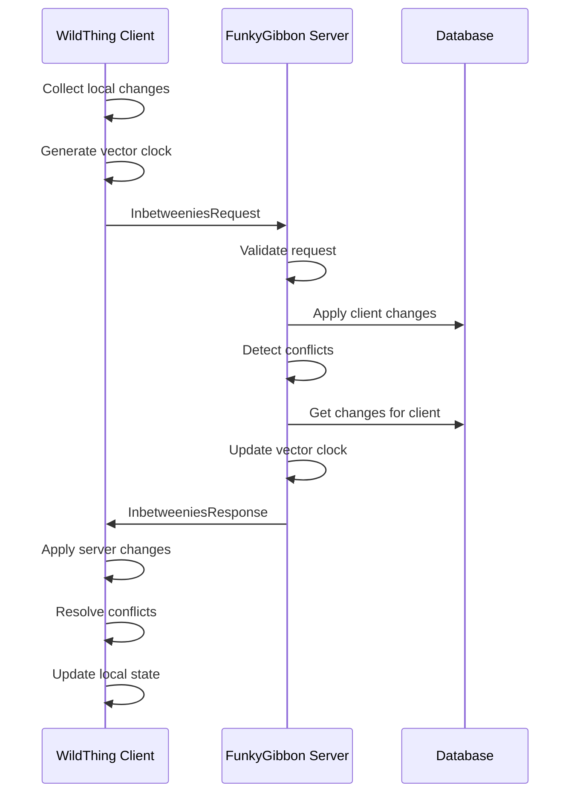

# Inbetweenies Protocol - Detailed Specification

## Overview

The Inbetweenies protocol is a bidirectional synchronization protocol designed for distributed smart home knowledge graphs. It enables efficient data synchronization between WildThing (Swift) clients and FunkyGibbon (Python) servers while handling conflicts, maintaining consistency, and supporting offline operation.

## Protocol Design Principles

1. **Eventual Consistency**: All nodes will eventually converge to the same state
2. **Conflict Detection**: Automatic detection of concurrent modifications
3. **Offline First**: Full functionality without network connectivity
4. **Bandwidth Efficient**: Minimal data transfer with compression support
5. **Version Aware**: Complete version history with causal ordering
6. **Platform Agnostic**: JSON-based messages work across platforms

## Protocol Flow



## Message Format

### 1. Sync Request (Client → Server)

```json
{
  "protocol_version": "inbetweenies-v1",
  "device_id": "550e8400-e29b-41d4-a716-446655440000",
  "user_id": "user-123",
  "session_id": "session-456",
  "vector_clock": {
    "device-1": "2024-01-15T10:30:00Z-001",
    "device-2": "2024-01-15T09:45:00Z-042",
    "server": "2024-01-15T10:00:00Z-100"
  },
  "changes": [
    {
      "change_type": "create|update|delete",
      "entity_id": "entity-789",
      "entity_version": "2024-01-15T10:30:00Z-device1-001",
      "entity_type": "device",
      "parent_versions": ["2024-01-15T09:00:00Z-server-099"],
      "content": {
        "name": "Living Room Light",
        "status": "on",
        "brightness": 80
      },
      "timestamp": "2024-01-15T10:30:00Z",
      "checksum": "sha256:abcdef...",
      "device_id": "device-1",
      "user_id": "user-123"
    }
  ],
  "compression": "gzip|zstd|none",
  "capabilities": ["batch_1000", "compression_zstd", "streaming"],
  "metadata": {
    "client_version": "1.0.0",
    "platform": "iOS 17.2",
    "sync_reason": "manual|periodic|triggered"
  }
}
```

### 2. Sync Response (Server → Client)

```json
{
  "protocol_version": "inbetweenies-v1",
  "server_time": "2024-01-15T10:31:00Z",
  "session_id": "session-456",
  "vector_clock": {
    "device-1": "2024-01-15T10:30:00Z-001",
    "device-2": "2024-01-15T10:20:00Z-050",
    "device-3": "2024-01-15T10:25:00Z-010",
    "server": "2024-01-15T10:31:00Z-105"
  },
  "changes": [
    {
      "change_type": "update",
      "entity_id": "entity-456",
      "entity_version": "2024-01-15T10:20:00Z-device2-050",
      "entity_type": "room",
      "parent_versions": ["2024-01-15T10:00:00Z-server-100"],
      "content": {
        "name": "Kitchen",
        "temperature": 22.5
      },
      "timestamp": "2024-01-15T10:20:00Z",
      "device_id": "device-2",
      "user_id": "user-123"
    }
  ],
  "conflicts": [
    {
      "entity_id": "entity-789",
      "conflict_type": "version_mismatch|content_conflict|delete_update",
      "local_version": "2024-01-15T10:30:00Z-device1-001",
      "server_version": "2024-01-15T10:25:00Z-device3-010",
      "resolution_hint": "accept_local|accept_server|merge|manual",
      "conflict_details": {
        "conflicting_fields": ["status", "brightness"],
        "local_values": {"status": "on", "brightness": 80},
        "server_values": {"status": "off", "brightness": 0}
      }
    }
  ],
  "next_sync_token": "sync-token-12345",
  "sync_status": "success|partial|failed",
  "server_capabilities": ["batch_5000", "compression_all", "streaming", "real_time"],
  "rate_limit": {
    "remaining": 95,
    "reset_at": "2024-01-15T11:00:00Z"
  }
}
```

## Data Types

### Entity Change Structure

```typescript
interface EntityChange {
  change_type: ChangeType;
  entity_id: string;
  entity_version: string;
  entity_type?: string;
  parent_versions: string[];
  content?: Record<string, any>;
  timestamp: string;  // ISO 8601
  checksum?: string;
  device_id: string;
  user_id: string;
  metadata?: ChangeMetadata;
}

enum ChangeType {
  CREATE = "create",
  UPDATE = "update",
  DELETE = "delete"
}

interface ChangeMetadata {
  source?: string;  // "manual", "automation", "import"
  reason?: string;
  correlation_id?: string;
  batch_id?: string;
}
```

### Vector Clock

```typescript
interface VectorClock {
  [nodeId: string]: string;  // version string
}

// Version format: "{timestamp}-{node_id}-{sequence}"
// Example: "2024-01-15T10:30:00Z-device1-001"
```

### Conflict Information

```typescript
interface ConflictInfo {
  entity_id: string;
  conflict_type: ConflictType;
  local_version: string;
  server_version: string;
  resolution_hint?: ResolutionStrategy;
  conflict_details?: ConflictDetails;
}

enum ConflictType {
  VERSION_MISMATCH = "version_mismatch",
  CONTENT_CONFLICT = "content_conflict",
  DELETE_UPDATE = "delete_update",
  CYCLIC_RELATIONSHIP = "cyclic_relationship"
}

enum ResolutionStrategy {
  ACCEPT_LOCAL = "accept_local",
  ACCEPT_SERVER = "accept_server",
  MERGE = "merge",
  MANUAL = "manual"
}

interface ConflictDetails {
  conflicting_fields?: string[];
  local_values?: Record<string, any>;
  server_values?: Record<string, any>;
  suggested_merge?: Record<string, any>;
}
```

## Sync Algorithm

### 1. Change Collection (Client Side)

```python
def collect_local_changes(last_sync_time, device_id):
    changes = []
    
    # Get all entities modified since last sync
    modified_entities = storage.get_modified_since(last_sync_time)
    
    for entity in modified_entities:
        change = {
            "change_type": determine_change_type(entity),
            "entity_id": entity.id,
            "entity_version": entity.version,
            "entity_type": entity.type,
            "parent_versions": entity.parent_versions,
            "content": entity.content if not entity.deleted else None,
            "timestamp": entity.last_modified,
            "device_id": device_id,
            "user_id": entity.user_id
        }
        changes.append(change)
    
    return changes
```

### 2. Vector Clock Management

```python
class VectorClock:
    def __init__(self, clocks=None):
        self.clocks = clocks or {}
    
    def increment(self, node_id):
        """Increment clock for node"""
        current = self.clocks.get(node_id, self._zero_version())
        timestamp, _, seq = self._parse_version(current)
        new_seq = int(seq) + 1
        self.clocks[node_id] = f"{datetime.utcnow().isoformat()}-{node_id}-{new_seq:03d}"
    
    def merge(self, other_clock):
        """Merge with another vector clock"""
        for node_id, version in other_clock.items():
            if node_id not in self.clocks:
                self.clocks[node_id] = version
            else:
                # Keep the greater version
                if self._compare_versions(version, self.clocks[node_id]) > 0:
                    self.clocks[node_id] = version
    
    def happens_before(self, other):
        """Check if this clock happens before other"""
        for node_id, version in self.clocks.items():
            other_version = other.clocks.get(node_id, self._zero_version())
            if self._compare_versions(version, other_version) > 0:
                return False
        return True
    
    def are_concurrent(self, other):
        """Check if clocks are concurrent (no causal relationship)"""
        return not self.happens_before(other) and not other.happens_before(self)
```

### 3. Conflict Detection

```python
def detect_conflict(local_entity, remote_change):
    # No conflict for new entities
    if not local_entity:
        return None
    
    # Deleted locally but updated remotely
    if local_entity.deleted and remote_change.change_type == "update":
        return Conflict(
            type=ConflictType.DELETE_UPDATE,
            local_version=local_entity.version,
            remote_version=remote_change.entity_version
        )
    
    # Check version lineage
    if local_entity.version not in remote_change.parent_versions:
        # Versions have diverged
        local_clock = VectorClock({local_entity.device_id: local_entity.version})
        remote_clock = VectorClock({remote_change.device_id: remote_change.entity_version})
        
        if local_clock.are_concurrent(remote_clock):
            # True conflict - concurrent modifications
            return Conflict(
                type=ConflictType.VERSION_MISMATCH,
                local_version=local_entity.version,
                remote_version=remote_change.entity_version,
                details=analyze_content_differences(local_entity, remote_change)
            )
    
    return None
```

### 4. Conflict Resolution

```python
class ConflictResolver:
    def resolve(self, conflict, local_entity, remote_change, strategy=None):
        if strategy == ResolutionStrategy.ACCEPT_LOCAL:
            return self._keep_local(local_entity, remote_change)
        
        elif strategy == ResolutionStrategy.ACCEPT_SERVER:
            return self._accept_remote(remote_change)
        
        elif strategy == ResolutionStrategy.MERGE:
            return self._merge_changes(local_entity, remote_change, conflict)
        
        else:
            # Automatic resolution based on heuristics
            return self._auto_resolve(conflict, local_entity, remote_change)
    
    def _auto_resolve(self, conflict, local_entity, remote_change):
        # Last-write-wins for simple conflicts
        if conflict.type == ConflictType.VERSION_MISMATCH:
            local_time = parse_timestamp(local_entity.last_modified)
            remote_time = parse_timestamp(remote_change.timestamp)
            
            if remote_time > local_time:
                return self._accept_remote(remote_change)
            else:
                return self._keep_local(local_entity, remote_change)
        
        # Delete wins for delete-update conflicts
        elif conflict.type == ConflictType.DELETE_UPDATE:
            if local_entity.deleted:
                return self._keep_local(local_entity, remote_change)
            else:
                return self._accept_remote(remote_change)
        
        # Manual resolution required for complex conflicts
        return None
    
    def _merge_changes(self, local_entity, remote_change, conflict):
        # Three-way merge based on common ancestor
        common_ancestor = self._find_common_ancestor(local_entity, remote_change)
        
        if not common_ancestor:
            # No common ancestor, fall back to field-level merge
            return self._field_level_merge(local_entity, remote_change)
        
        merged_content = {}
        all_fields = set(local_entity.content.keys()) | set(remote_change.content.keys())
        
        for field in all_fields:
            local_value = local_entity.content.get(field)
            remote_value = remote_change.content.get(field)
            ancestor_value = common_ancestor.content.get(field)
            
            if local_value == remote_value:
                # No conflict
                merged_content[field] = local_value
            elif local_value == ancestor_value:
                # Only remote changed
                merged_content[field] = remote_value
            elif remote_value == ancestor_value:
                # Only local changed
                merged_content[field] = local_value
            else:
                # Both changed - need resolution
                merged_content[field] = self._resolve_field_conflict(
                    field, local_value, remote_value, ancestor_value
                )
        
        return HomeEntity(
            id=local_entity.id,
            version=generate_merge_version(local_entity.version, remote_change.entity_version),
            entity_type=local_entity.entity_type,
            content=merged_content,
            parent_versions=[local_entity.version, remote_change.entity_version]
        )
```

## Compression

### Supported Compression Algorithms

1. **gzip**: Standard compression, good balance
2. **zstd**: Better compression ratio and speed
3. **brotli**: Best compression for text data
4. **none**: No compression

### Compression Negotiation

```python
def negotiate_compression(client_capabilities, server_capabilities):
    client_compressions = client_capabilities.get("compression", [])
    server_compressions = server_capabilities.get("compression", [])
    
    # Priority order
    preference_order = ["zstd", "brotli", "gzip"]
    
    for compression in preference_order:
        if compression in client_compressions and compression in server_compressions:
            return compression
    
    return "none"
```

## Streaming Support

### Large Dataset Handling

For synchronizing large numbers of changes, the protocol supports streaming:

```json
{
  "protocol_version": "inbetweenies-v1-stream",
  "stream_id": "stream-123",
  "sequence": 1,
  "total_sequences": 5,
  "changes": [...],  // Partial changes
  "is_final": false
}
```

### Stream Processing

```python
class StreamProcessor:
    def __init__(self):
        self.active_streams = {}
    
    async def process_stream_message(self, message):
        stream_id = message["stream_id"]
        
        if stream_id not in self.active_streams:
            self.active_streams[stream_id] = StreamState()
        
        stream = self.active_streams[stream_id]
        stream.add_sequence(message["sequence"], message["changes"])
        
        if message["is_final"]:
            # Process complete stream
            all_changes = stream.get_all_changes()
            del self.active_streams[stream_id]
            return await self.process_complete_sync(all_changes)
        
        return StreamResponse(
            stream_id=stream_id,
            next_sequence=message["sequence"] + 1,
            status="continue"
        )
```

## Error Handling

### Error Response Format

```json
{
  "error": {
    "code": "SYNC_ERROR",
    "message": "Human-readable error message",
    "details": {
      "failed_changes": ["entity-123", "entity-456"],
      "retry_after": "2024-01-15T10:35:00Z"
    }
  },
  "partial_sync": {
    "successful_changes": 45,
    "failed_changes": 2,
    "vector_clock": {...}
  }
}
```

### Error Codes

| Code | Description | Retry |
|------|-------------|-------|
| `PROTOCOL_VERSION_MISMATCH` | Unsupported protocol version | No |
| `AUTHENTICATION_FAILED` | Invalid credentials | No |
| `RATE_LIMIT_EXCEEDED` | Too many requests | Yes |
| `SYNC_IN_PROGRESS` | Another sync is active | Yes |
| `INVALID_VECTOR_CLOCK` | Vector clock corrupted | No |
| `STORAGE_ERROR` | Database error | Yes |
| `PARTIAL_SYNC_FAILURE` | Some changes failed | Partial |

## Security Considerations

### 1. Authentication

Every request must include authentication:

```http
Authorization: Bearer <jwt-token>
X-Device-ID: device-uuid
X-Request-ID: request-uuid
```

### 2. Data Integrity

- All changes include checksums
- Version strings are cryptographically signed
- TLS 1.3 required for transport

### 3. Rate Limiting

- Per-device rate limits
- Exponential backoff on errors
- Sync token prevents replay attacks

## Performance Optimizations

### 1. Delta Sync

Only send changed fields:

```json
{
  "change_type": "update",
  "entity_id": "entity-123",
  "delta": {
    "status": "off",
    "last_seen": "2024-01-15T10:30:00Z"
  },
  "base_version": "2024-01-15T10:00:00Z-server-100"
}
```

### 2. Batch Size Limits

- Maximum 1000 changes per request
- Maximum 10MB uncompressed payload
- Automatic pagination for large syncs

### 3. Selective Sync

Sync only specific entity types:

```json
{
  "sync_filter": {
    "entity_types": ["device", "room"],
    "modified_since": "2024-01-15T00:00:00Z",
    "exclude_deleted": true
  }
}
```

## Implementation Guidelines

### Client Implementation

```swift
// Swift/WildThing implementation
protocol InbetweeniesClient {
    func prepareSync() async throws -> InbetweeniesRequest
    func processResponse(_ response: InbetweeniesResponse) async throws
    func resolveConflicts(_ conflicts: [ConflictInfo]) async throws
}

class InbetweeniesClientImpl: InbetweeniesClient {
    private let storage: WildThingStorage
    private let conflictResolver: ConflictResolver
    private var vectorClock: VectorClock
    
    func prepareSync() async throws -> InbetweeniesRequest {
        let changes = try await collectLocalChanges()
        vectorClock.increment(deviceId)
        
        return InbetweeniesRequest(
            protocolVersion: "inbetweenies-v1",
            deviceId: deviceId,
            userId: userId,
            vectorClock: vectorClock.toDict(),
            changes: changes
        )
    }
}
```

### Server Implementation

```python
# Python/FunkyGibbon implementation
class InbetweeniesServer:
    async def handle_sync(self, request: InbetweeniesRequest) -> InbetweeniesResponse:
        # Validate request
        self._validate_request(request)
        
        # Apply changes with conflict detection
        conflicts = await self._apply_changes(request.changes)
        
        # Get changes for client
        client_changes = await self._get_changes_for_client(
            request.user_id,
            request.vector_clock,
            request.device_id
        )
        
        # Update vector clock
        updated_clock = self._merge_vector_clocks(
            request.vector_clock,
            self.server_clock
        )
        
        return InbetweeniesResponse(
            vector_clock=updated_clock,
            changes=client_changes,
            conflicts=conflicts
        )
```

## Testing

### Test Vectors

```json
{
  "test_cases": [
    {
      "name": "Simple sync without conflicts",
      "request": {...},
      "expected_response": {...}
    },
    {
      "name": "Concurrent modification conflict",
      "request": {...},
      "expected_response": {...}
    },
    {
      "name": "Delete-update conflict",
      "request": {...},
      "expected_response": {...}
    }
  ]
}
```

### Compliance Testing

1. **Protocol Compliance**: Validate message format
2. **Conflict Resolution**: Test all conflict scenarios
3. **Performance**: Sync 10,000 entities < 5 seconds
4. **Reliability**: 99.9% sync success rate

## Future Extensions

### Version 2.0 Features

1. **Real-time Sync**: WebSocket-based live updates
2. **Differential Sync**: Binary diff for large content
3. **Encrypted Sync**: End-to-end encryption option
4. **Multi-Region**: Geographic sync optimization
5. **Offline Queuing**: Better offline change management

### Backward Compatibility

- Version negotiation in handshake
- Graceful degradation for older clients
- Migration path for protocol updates

## Conclusion

The Inbetweenies protocol provides a robust foundation for distributed smart home data synchronization. Its design balances simplicity with powerful features like conflict resolution, offline support, and efficient data transfer. The protocol's flexibility allows it to evolve while maintaining backward compatibility.