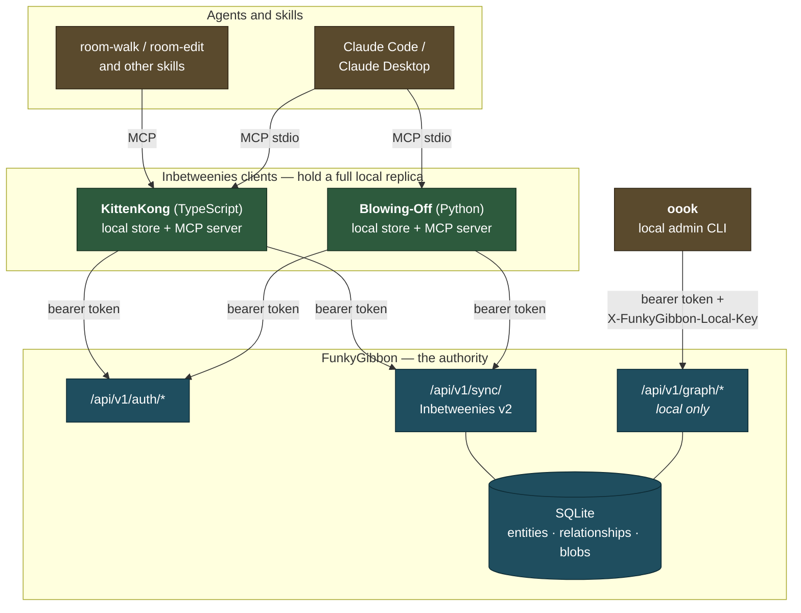
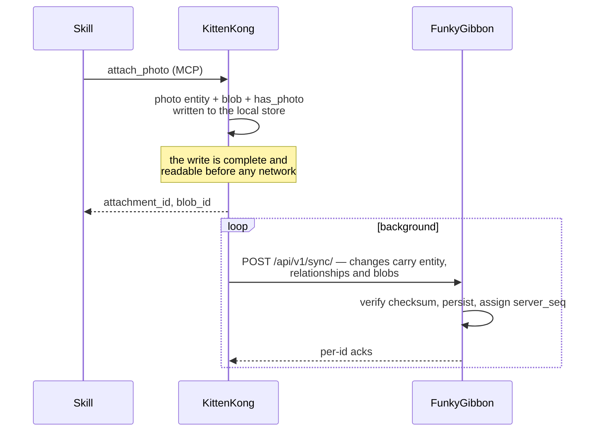

# Components and supported access patterns

Who may talk to what, and over which credential. Anything not drawn here is not
a supported path — the system's recurring failure has been callers inventing one
when the supported path had a gap.

## The three access patterns

| Caller | Reaches | Credential | Why |
|---|---|---|---|
| **Agents / skills** | a client's MCP server | none (local process) | All reads and writes are MCP tools against a local replica. |
| **KittenKong, Blowing-Off** | `auth` + `sync` **only** | bearer token | They hold the whole graph locally. Sync is the only thing they need from the server. |
| **`oook`** | `auth` + `graph` REST | bearer token **plus** `X-FunkyGibbon-Local-Key` | Local administration and testing, on the server's own machine. |

**FunkyGibbon serves no MCP.** MCP is the client-side interface, served against
a local replica. A server-side MCP endpoint was a third way to write the same
data — and the one whose writes were never committed, so everything using it
silently did nothing.

## Why the boundary is enforced, not documented

Every one of these was a real invention filling a real gap:

| Gap | What got invented | Cost |
|---|---|---|
| No way to attach a photo | `note` + inline base64 + a `has_blob` edge pointing at the note | Six blob conventions across two installs; a migration to undo |
| MCP writes silently discarded | a parallel REST helper | Two write paths, one enforced |
| No delete (append-only by design) | `DELETE /relationships/{id}` to a route that never existed | Silent 404s |
| Sync could not carry bytes | direct server calls for attachments | The boundary this diagram exists to draw |

The second credential exists so the first column cannot recur quietly: a sync
client that reaches for the REST API gets a 403 explaining which door it should
be using.

## Writes

Local-first: the write lands in the replica and syncs. Blob bytes travel in the
sync payload (`SyncChange.blobs`), which is what removes the last reason to call
the server directly.

## Append-only

Nothing is deleted. Removal appends a tombstone version; a record that was
simply *wrong* is marked as an error behind that tombstone. "This was removed"
and "this was never here" are different facts, and history keeps both. There is
no delete tool and no DELETE endpoint for graph data.

## Data model in one line

An entity carrying a blob is an **attachment entity** — `photo` for an image,
`manual` for a PDF — and top-level `content.blob_id` is the only link to the
blobs table. The entity type is the flag; no relationship ever points at a blob.
An *ordered* sequence of attachments stays inline as `content.images[]`, because
relationships are an unordered set. See
[ADR-013 §3](adr/ADR-013-house-vocabulary-cleanup.md).
