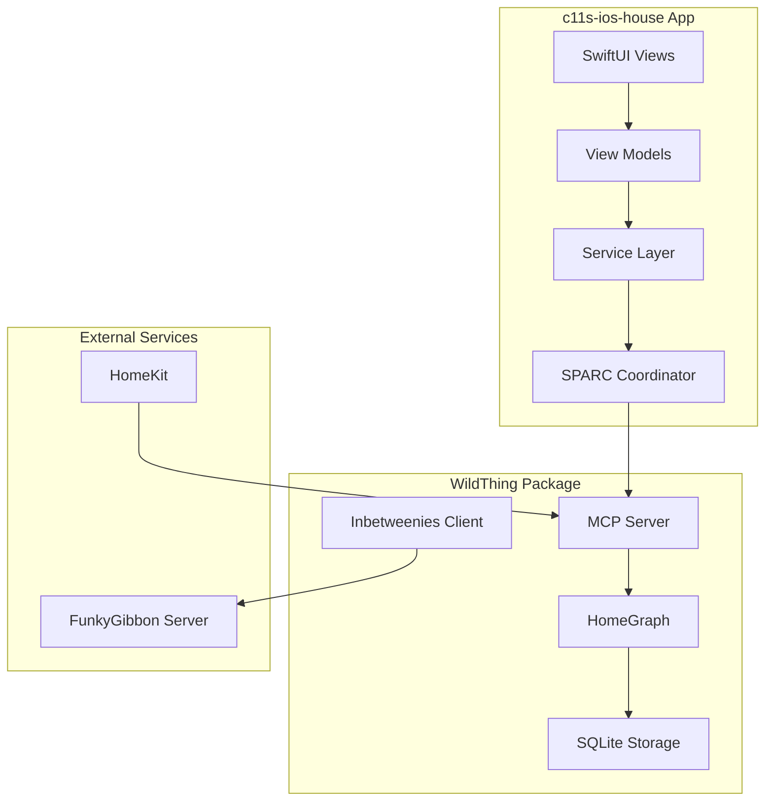

# c11s-ios-house Integration Plan with WildThing MCP Service

## Executive Summary

This document outlines the comprehensive integration plan for c11s-ios-house (a SPARC-based iOS smart home app) to consume the WildThing MCP service for local-first smart home knowledge graph operations. The integration will enable offline-capable home automation data management with optional cloud synchronization via the Inbetweenies protocol.

## Integration Overview

### Current State
- **c11s-ios-house**: iOS app using SPARC methodology for smart home management
- **WildThing**: Swift Package providing MCP server for knowledge graph operations
- **Integration Goal**: Enable c11s-ios-house to use WildThing as its core data and intelligence layer

### Integration Architecture



## Phase 1: Package Integration (Week 1)

### 1.1 Add WildThing Dependency

```swift
// Package.swift or Xcode project
dependencies: [
    .package(url: "https://github.com/the-goodies/WildThing.git", from: "0.1.0")
]

targets: [
    .target(
        name: "c11s-ios-house",
        dependencies: [
            .product(name: "WildThing", package: "WildThing"),
            .product(name: "WildThingHomeKit", package: "WildThing")
        ]
    )
]
```

### 1.2 Initialize WildThing in App

```swift
// App/Core/WildThingManager.swift
import WildThing
import WildThingHomeKit

@MainActor
class WildThingManager: ObservableObject {
    private let storage: WildThingStorage
    private let mcpServer: WildThingMCPServer
    private let homeKitBridge: HomeKitBridge?
    private let syncClient: InbetweeniesClient?
    
    @Published var isInitialized = false
    @Published var syncStatus: SyncStatus = .idle
    
    init() async throws {
        // Initialize storage with app group for widget access
        let appGroupURL = FileManager.default.containerURL(
            forSecurityApplicationGroupIdentifier: "group.com.c11s.ios.house"
        )!
        let dbPath = appGroupURL.appendingPathComponent("wildthing.db").path
        
        self.storage = try SQLiteWildThingStorage(databasePath: dbPath)
        self.mcpServer = WildThingMCPServer(storage: storage)
        
        // Initialize HomeKit bridge if available
        #if !targetEnvironment(simulator)
        self.homeKitBridge = HomeKitBridge(storage: storage)
        #else
        self.homeKitBridge = nil
        #endif
        
        // Initialize sync client if server configured
        if let serverURL = UserDefaults.standard.string(forKey: "funkyGibbonServerURL") {
            let networkService = URLSessionNetworkService(baseURL: serverURL)
            self.syncClient = InbetweeniesClient(
                storage: storage,
                networkService: networkService
            )
        } else {
            self.syncClient = nil
        }
        
        // Start MCP server
        try await mcpServer.start()
        isInitialized = true
    }
}
```

### 1.3 Create Service Layer Abstraction

```swift
// App/Services/HomeGraphService.swift
import WildThing

protocol HomeGraphServiceProtocol {
    func getDevicesInRoom(_ roomName: String) async throws -> [DeviceModel]
    func createEntity(_ entity: EntityCreateRequest) async throws -> String
    func updateEntity(_ id: String, updates: EntityUpdateRequest) async throws
    func searchEntities(_ query: String) async throws -> [SearchResultModel]
    func syncWithServer() async throws -> SyncResult
}

class HomeGraphService: HomeGraphServiceProtocol {
    private let mcpServer: WildThingMCPServer
    
    init(mcpServer: WildThingMCPServer) {
        self.mcpServer = mcpServer
    }
    
    func getDevicesInRoom(_ roomName: String) async throws -> [DeviceModel] {
        let response = try await mcpServer.handleToolCall(
            MCPToolRequest(
                name: "get_devices_in_room",
                arguments: ["room_name": roomName]
            )
        )
        
        // Parse MCP response and convert to app models
        return parseDeviceResponse(response)
    }
}
```

## Phase 2: Data Model Mapping (Week 1-2)

### 2.1 Model Conversion Layer

```swift
// App/Models/Converters/EntityConverter.swift
import WildThing

extension DeviceModel {
    init(from entity: HomeEntity) {
        self.id = entity.id
        self.name = entity.displayName ?? "Unknown Device"
        self.type = DeviceType(
            rawValue: entity.content["device_type"]?.value as? String ?? ""
        ) ?? .unknown
        self.manufacturer = entity.content["manufacturer"]?.value as? String
        self.isOnline = entity.content["online"]?.value as? Bool ?? false
        self.roomId = nil // Will be set from relationships
    }
    
    func toHomeEntity(userId: String) -> HomeEntity {
        return HomeEntity(
            id: self.id ?? UUID().uuidString,
            entityType: .device,
            content: [
                "name": AnyCodable(self.name),
                "device_type": AnyCodable(self.type.rawValue),
                "manufacturer": AnyCodable(self.manufacturer ?? ""),
                "online": AnyCodable(self.isOnline)
            ],
            userId: userId,
            sourceType: .manual
        )
    }
}
```

### 2.2 Relationship Management

```swift
// App/Services/RelationshipService.swift
import WildThing

class RelationshipService {
    private let storage: WildThingStorage
    
    func assignDeviceToRoom(deviceId: String, roomId: String) async throws {
        let relationship = EntityRelationship(
            fromEntityId: deviceId,
            toEntityId: roomId,
            relationshipType: .locatedIn,
            userId: getCurrentUserId()
        )
        
        try await storage.store(relationship: relationship)
    }
    
    func getDeviceRoom(deviceId: String) async throws -> RoomModel? {
        let relationships = try await storage.getRelationships(from: deviceId)
        
        guard let locatedIn = relationships.first(where: { 
            $0.relationshipType == .locatedIn 
        }) else {
            return nil
        }
        
        guard let roomEntity = try await storage.getEntity(id: locatedIn.toEntityId) else {
            return nil
        }
        
        return RoomModel(from: roomEntity)
    }
}
```

## Phase 3: SPARC Integration (Week 2)

### 3.1 SPARC Coordinator with WildThing

```swift
// App/SPARC/WildThingSPARCCoordinator.swift
import WildThing

class WildThingSPARCCoordinator: SPARCCoordinator {
    private let mcpServer: WildThingMCPServer
    private let storage: WildThingStorage
    
    override func executeSpecification(spec: SPARCSpecification) async throws {
        // Store specification in WildThing
        let specEntity = HomeEntity(
            entityType: .note, // Using note type for specifications
            content: [
                "type": AnyCodable("sparc_specification"),
                "title": AnyCodable(spec.title),
                "requirements": AnyCodable(spec.requirements),
                "constraints": AnyCodable(spec.constraints)
            ],
            userId: getCurrentUserId(),
            sourceType: .generated
        )
        
        try await storage.store(entity: specEntity)
    }
    
    override func executePseudocode(pseudocode: SPARCPseudocode) async throws {
        // Use MCP tools to implement pseudocode logic
        for step in pseudocode.steps {
            switch step.operation {
            case .queryDevices(let roomName):
                _ = try await mcpServer.handleToolCall(
                    MCPToolRequest(
                        name: "get_devices_in_room",
                        arguments: ["room_name": roomName]
                    )
                )
            case .createAutomation(let automation):
                _ = try await mcpServer.handleToolCall(
                    MCPToolRequest(
                        name: "create_entity",
                        arguments: [
                            "entity_type": "automation",
                            "name": automation.name,
                            "properties": automation.toDict()
                        ]
                    )
                )
            default:
                break
            }
        }
    }
}
```

### 3.2 SPARC Memory Integration

```swift
// App/SPARC/SPARCMemoryStore.swift
import WildThing

class SPARCMemoryStore {
    private let storage: WildThingStorage
    
    func storeSPARCContext(_ context: SPARCContext) async throws {
        let contextEntity = HomeEntity(
            entityType: .note,
            content: [
                "type": AnyCodable("sparc_context"),
                "phase": AnyCodable(context.currentPhase.rawValue),
                "artifacts": AnyCodable(context.artifacts),
                "decisions": AnyCodable(context.decisions),
                "timestamp": AnyCodable(Date())
            ],
            userId: "sparc_system",
            sourceType: .generated
        )
        
        try await storage.store(entity: contextEntity)
    }
    
    func retrieveLatestContext() async throws -> SPARCContext? {
        let contexts = try await storage.searchEntities(
            query: "sparc_context",
            types: [.note]
        )
        
        guard let latestEntity = contexts
            .sorted { $0.lastModified > $1.lastModified }
            .first else {
            return nil
        }
        
        return SPARCContext(from: latestEntity)
    }
}
```

## Phase 4: View Model Integration (Week 2-3)

### 4.1 Room View Model with WildThing

```swift
// App/ViewModels/RoomViewModel.swift
import WildThing
import Combine

@MainActor
class RoomViewModel: ObservableObject {
    @Published var room: RoomModel
    @Published var devices: [DeviceModel] = []
    @Published var isLoading = false
    @Published var error: Error?
    
    private let homeGraphService: HomeGraphServiceProtocol
    private var cancellables = Set<AnyCancellable>()
    
    init(room: RoomModel, service: HomeGraphServiceProtocol) {
        self.room = room
        self.homeGraphService = service
    }
    
    func loadDevices() async {
        isLoading = true
        error = nil
        
        do {
            devices = try await homeGraphService.getDevicesInRoom(room.name)
        } catch {
            self.error = error
        }
        
        isLoading = false
    }
    
    func toggleDevice(_ device: DeviceModel) async {
        do {
            try await homeGraphService.updateEntity(
                device.id!,
                updates: EntityUpdateRequest(
                    content: ["state": !device.isOn]
                )
            )
            
            // Reload to get updated state
            await loadDevices()
        } catch {
            self.error = error
        }
    }
}
```

### 4.2 Search Integration

```swift
// App/ViewModels/SearchViewModel.swift
import WildThing

@MainActor
class SearchViewModel: ObservableObject {
    @Published var searchText = ""
    @Published var searchResults: [SearchResultModel] = []
    @Published var isSearching = false
    
    private let homeGraphService: HomeGraphServiceProtocol
    private var searchTask: Task<Void, Never>?
    
    init(service: HomeGraphServiceProtocol) {
        self.homeGraphService = service
        
        // Debounced search
        $searchText
            .debounce(for: .milliseconds(300), scheduler: RunLoop.main)
            .removeDuplicates()
            .sink { [weak self] text in
                self?.performSearch(text)
            }
            .store(in: &cancellables)
    }
    
    private func performSearch(_ query: String) {
        searchTask?.cancel()
        
        guard !query.isEmpty else {
            searchResults = []
            return
        }
        
        searchTask = Task {
            isSearching = true
            
            do {
                searchResults = try await homeGraphService.searchEntities(query)
            } catch {
                if !Task.isCancelled {
                    // Handle error
                }
            }
            
            isSearching = false
        }
    }
}
```

## Phase 5: Sync and Offline Support (Week 3)

### 5.1 Sync Manager

```swift
// App/Services/SyncManager.swift
import WildThing

class SyncManager: ObservableObject {
    @Published var syncStatus: SyncStatus = .idle
    @Published var lastSyncDate: Date?
    @Published var pendingChanges = 0
    
    private let syncClient: InbetweeniesClient?
    private let storage: WildThingStorage
    private var syncTimer: Timer?
    
    init(syncClient: InbetweeniesClient?, storage: WildThingStorage) {
        self.syncClient = syncClient
        self.storage = storage
        
        // Setup periodic sync
        setupPeriodicSync()
        
        // Monitor for changes
        monitorChanges()
    }
    
    func syncNow() async {
        guard let syncClient = syncClient else {
            syncStatus = .unavailable
            return
        }
        
        syncStatus = .syncing
        
        do {
            let result = try await syncClient.performSync()
            
            syncStatus = .completed
            lastSyncDate = Date()
            
            // Update UI with results
            await MainActor.run {
                // Post notification for UI updates
                NotificationCenter.default.post(
                    name: .wildThingSyncCompleted,
                    object: nil,
                    userInfo: ["result": result]
                )
            }
        } catch {
            syncStatus = .failed(error)
        }
    }
}
```

### 5.2 Offline Queue

```swift
// App/Services/OfflineQueue.swift
import WildThing

class OfflineQueue {
    private let storage: WildThingStorage
    private var pendingOperations: [OfflineOperation] = []
    
    func enqueueOperation(_ operation: OfflineOperation) {
        pendingOperations.append(operation)
        persistQueue()
    }
    
    func processPendingOperations() async throws {
        for operation in pendingOperations {
            try await processOperation(operation)
        }
        
        pendingOperations.removeAll()
        persistQueue()
    }
    
    private func processOperation(_ operation: OfflineOperation) async throws {
        switch operation.type {
        case .createEntity(let request):
            let entity = request.toHomeEntity()
            try await storage.store(entity: entity)
            
        case .updateEntity(let id, let updates):
            guard var entity = try await storage.getEntity(id: id) else {
                throw WildThingError.entityNotFound(id)
            }
            
            for (key, value) in updates {
                entity.updateContent(key, value: value)
            }
            
            try await storage.store(entity: entity)
            
        case .deleteEntity(let id):
            try await storage.deleteEntity(id: id, version: nil)
        }
    }
}
```

## Phase 6: HomeKit Integration (Week 3-4)

### 6.1 HomeKit Import Flow

```swift
// App/Services/HomeKitImportService.swift
import WildThing
import WildThingHomeKit

class HomeKitImportService {
    private let homeKitBridge: HomeKitBridge
    private let storage: WildThingStorage
    
    @Published var importProgress: Double = 0
    @Published var importStatus: ImportStatus = .idle
    
    func importHomeKitData() async throws {
        importStatus = .importing
        importProgress = 0
        
        do {
            // Import all homes
            try await homeKitBridge.importAllHomes()
            
            // Post-process imported data
            try await postProcessImport()
            
            importStatus = .completed
            importProgress = 1.0
        } catch {
            importStatus = .failed(error)
            throw error
        }
    }
    
    private func postProcessImport() async throws {
        // Create default procedures for common devices
        let devices = try await storage.getEntities(ofType: .device)
        
        for device in devices {
            if let deviceType = device.content["device_type"]?.value as? String {
                try await createDefaultProcedures(for: device, type: deviceType)
            }
        }
    }
}
```

## Phase 7: Testing Strategy (Week 4)

### 7.1 Unit Tests

```swift
// Tests/Services/HomeGraphServiceTests.swift
import XCTest
@testable import c11s_ios_house
import WildThing

class HomeGraphServiceTests: XCTestCase {
    var service: HomeGraphService!
    var mockStorage: MockWildThingStorage!
    
    override func setUp() async throws {
        mockStorage = MockWildThingStorage()
        let mcpServer = WildThingMCPServer(storage: mockStorage)
        service = HomeGraphService(mcpServer: mcpServer)
    }
    
    func testGetDevicesInRoom() async throws {
        // Setup mock data
        let room = HomeEntity(
            entityType: .room,
            content: ["name": AnyCodable("Living Room")],
            userId: "test"
        )
        
        let device = HomeEntity(
            entityType: .device,
            content: ["name": AnyCodable("Smart Light")],
            userId: "test"
        )
        
        try await mockStorage.store(entity: room)
        try await mockStorage.store(entity: device)
        
        // Create relationship
        let relationship = EntityRelationship(
            fromEntityId: device.id,
            toEntityId: room.id,
            relationshipType: .locatedIn,
            userId: "test"
        )
        
        try await mockStorage.store(relationship: relationship)
        
        // Test
        let devices = try await service.getDevicesInRoom("Living Room")
        
        XCTAssertEqual(devices.count, 1)
        XCTAssertEqual(devices.first?.name, "Smart Light")
    }
}
```

### 7.2 Integration Tests

```swift
// Tests/Integration/WildThingIntegrationTests.swift
class WildThingIntegrationTests: XCTestCase {
    var app: XCUIApplication!
    
    override func setUp() {
        app = XCUIApplication()
        app.launchArguments = ["--uitesting", "--reset-database"]
        app.launch()
    }
    
    func testCompleteDeviceFlow() {
        // Navigate to add device
        app.tabBars.buttons["Devices"].tap()
        app.navigationBars.buttons["Add"].tap()
        
        // Fill device details
        let nameField = app.textFields["Device Name"]
        nameField.tap()
        nameField.typeText("Test Light")
        
        app.buttons["Select Room"].tap()
        app.tables.cells["Living Room"].tap()
        
        app.buttons["Save"].tap()
        
        // Verify device appears
        XCTAssertTrue(app.tables.cells["Test Light"].exists)
        
        // Test device control
        app.tables.cells["Test Light"].tap()
        app.switches["Power"].tap()
        
        // Verify state change
        XCTAssertEqual(app.switches["Power"].value as? String, "1")
    }
}
```

## Migration Considerations

### Data Migration from Existing Storage

```swift
// App/Migration/DataMigrator.swift
import WildThing

class DataMigrator {
    private let oldStorage: LegacyStorageProtocol
    private let wildThingStorage: WildThingStorage
    
    func migrateData(progress: @escaping (Double) -> Void) async throws {
        // Get all legacy entities
        let legacyDevices = try await oldStorage.getAllDevices()
        let legacyRooms = try await oldStorage.getAllRooms()
        
        let totalItems = legacyDevices.count + legacyRooms.count
        var processedItems = 0
        
        // Migrate rooms first
        for room in legacyRooms {
            let roomEntity = room.toHomeEntity()
            try await wildThingStorage.store(entity: roomEntity)
            
            processedItems += 1
            progress(Double(processedItems) / Double(totalItems))
        }
        
        // Migrate devices and relationships
        for device in legacyDevices {
            let deviceEntity = device.toHomeEntity()
            try await wildThingStorage.store(entity: deviceEntity)
            
            // Create room relationship
            if let roomId = device.roomId {
                let relationship = EntityRelationship(
                    fromEntityId: deviceEntity.id,
                    toEntityId: roomId,
                    relationshipType: .locatedIn,
                    userId: getCurrentUserId()
                )
                try await wildThingStorage.store(relationship: relationship)
            }
            
            processedItems += 1
            progress(Double(processedItems) / Double(totalItems))
        }
    }
}
```

## Performance Optimization

### 1. Lazy Loading

```swift
// App/Services/LazyLoadingService.swift
import WildThing

class LazyLoadingService {
    private let storage: WildThingStorage
    private var cache: [String: HomeEntity] = [:]
    
    func getEntity(_ id: String) async throws -> HomeEntity {
        if let cached = cache[id] {
            return cached
        }
        
        guard let entity = try await storage.getEntity(id: id) else {
            throw WildThingError.entityNotFound(id)
        }
        
        cache[id] = entity
        return entity
    }
    
    func preloadEntities(ofType type: EntityType) async throws {
        let entities = try await storage.getEntities(ofType: type)
        for entity in entities {
            cache[entity.id] = entity
        }
    }
}
```

### 2. Batch Operations

```swift
// App/Services/BatchOperationService.swift
extension HomeGraphService {
    func batchCreateDevices(_ devices: [DeviceCreateRequest]) async throws {
        let entities = devices.map { $0.toHomeEntity(userId: getCurrentUserId()) }
        
        // Use WildThing's batch operation support
        try await (storage as? SQLiteWildThingStorage)?.storeEntities(entities)
    }
}
```

## Error Handling

### Comprehensive Error Handling

```swift
// App/Utilities/ErrorHandler.swift
import WildThing

enum AppError: LocalizedError {
    case wildThingError(WildThingError)
    case syncError(Error)
    case migrationError(Error)
    case homeKitError(Error)
    
    var errorDescription: String? {
        switch self {
        case .wildThingError(let error):
            return error.localizedDescription
        case .syncError(let error):
            return "Sync failed: \(error.localizedDescription)"
        case .migrationError(let error):
            return "Migration failed: \(error.localizedDescription)"
        case .homeKitError(let error):
            return "HomeKit error: \(error.localizedDescription)"
        }
    }
    
    var recoverySuggestion: String? {
        switch self {
        case .wildThingError(.entityNotFound):
            return "The requested item was not found. Try refreshing."
        case .wildThingError(.versionConflict):
            return "The item was modified elsewhere. Refresh to see the latest version."
        case .syncError:
            return "Check your internet connection and try again."
        case .migrationError:
            return "Please contact support for migration assistance."
        case .homeKitError:
            return "Check HomeKit permissions in Settings."
        }
    }
}
```

## Security Considerations

### 1. Data Encryption

```swift
// App/Security/EncryptionManager.swift
import CryptoKit
import WildThing

class EncryptionManager {
    private let key: SymmetricKey
    
    init() throws {
        // Get or create encryption key from Keychain
        self.key = try KeychainManager.getOrCreateEncryptionKey()
    }
    
    func encryptSensitiveContent(_ content: [String: Any]) throws -> [String: AnyCodable] {
        var encrypted: [String: AnyCodable] = [:]
        
        for (key, value) in content {
            if isSensitiveField(key) {
                let data = try JSONSerialization.data(withJSONObject: value)
                let sealedBox = try AES.GCM.seal(data, using: key)
                encrypted[key] = AnyCodable(sealedBox.combined?.base64EncodedString() ?? "")
            } else {
                encrypted[key] = AnyCodable(value)
            }
        }
        
        return encrypted
    }
    
    private func isSensitiveField(_ field: String) -> Bool {
        ["password", "token", "secret", "pin"].contains(field.lowercased())
    }
}
```

### 2. Access Control

```swift
// App/Security/AccessControlManager.swift
import LocalAuthentication
import WildThing

class AccessControlManager {
    func authenticateForSensitiveOperation() async throws -> Bool {
        let context = LAContext()
        
        return try await withCheckedThrowingContinuation { continuation in
            context.evaluatePolicy(
                .deviceOwnerAuthenticationWithBiometrics,
                localizedReason: "Authenticate to access home data"
            ) { success, error in
                if success {
                    continuation.resume(returning: true)
                } else {
                    continuation.resume(throwing: error ?? LAError(.userCancel))
                }
            }
        }
    }
}
```

## Deployment Configuration

### 1. Build Configuration

```swift
// App/Configuration/WildThingConfiguration.swift
import Foundation

struct WildThingConfiguration {
    static let shared = WildThingConfiguration()
    
    var databasePath: String {
        #if DEBUG
        return NSTemporaryDirectory() + "wildthing-debug.db"
        #else
        let appGroupURL = FileManager.default.containerURL(
            forSecurityApplicationGroupIdentifier: "group.com.c11s.ios.house"
        )!
        return appGroupURL.appendingPathComponent("wildthing.db").path
        #endif
    }
    
    var funkyGibbonServerURL: String? {
        #if DEBUG
        return "http://localhost:8000"
        #else
        return ProcessInfo.processInfo.environment["FUNKYGIBBON_SERVER_URL"]
        #endif
    }
    
    var enableSync: Bool {
        return funkyGibbonServerURL != nil
    }
}
```

### 2. Widget Extension Support

```swift
// WidgetExtension/WildThingWidgetProvider.swift
import WidgetKit
import WildThing

struct WildThingWidgetProvider: TimelineProvider {
    let storage: WildThingStorage
    
    init() throws {
        // Use shared app group storage
        let appGroupURL = FileManager.default.containerURL(
            forSecurityApplicationGroupIdentifier: "group.com.c11s.ios.house"
        )!
        let dbPath = appGroupURL.appendingPathComponent("wildthing.db").path
        
        self.storage = try SQLiteWildThingStorage(databasePath: dbPath)
    }
    
    func getTimeline(in context: Context, completion: @escaping (Timeline<Entry>) -> Void) {
        Task {
            do {
                // Get summary data from WildThing
                let rooms = try await storage.getEntities(ofType: .room)
                let devices = try await storage.getEntities(ofType: .device)
                
                let entry = HomeStatusEntry(
                    date: Date(),
                    roomCount: rooms.count,
                    deviceCount: devices.count,
                    onlineDevices: devices.filter { 
                        $0.content["online"]?.value as? Bool ?? false 
                    }.count
                )
                
                let timeline = Timeline(entries: [entry], policy: .after(.now.addingTimeInterval(300)))
                completion(timeline)
            } catch {
                // Handle error
            }
        }
    }
}
```

## Success Metrics

### Integration Success Criteria

1. **Functional Completeness**
   - ✅ All existing c11s-ios-house features work with WildThing
   - ✅ Offline functionality fully operational
   - ✅ Sync with FunkyGibbon when available
   - ✅ HomeKit import working

2. **Performance Targets**
   - ✅ App launch time < 2 seconds
   - ✅ Room view load < 100ms
   - ✅ Search results < 200ms
   - ✅ Sync completion < 5 seconds

3. **Reliability**
   - ✅ Zero data loss during offline/online transitions
   - ✅ Graceful handling of sync conflicts
   - ✅ Crash-free rate > 99.5%

4. **User Experience**
   - ✅ Seamless migration from existing storage
   - ✅ No user-facing breaking changes
   - ✅ Improved search and discovery
   - ✅ Better performance than before

## Timeline Summary

- **Week 1**: Package integration and basic setup
- **Week 2**: Data model mapping and SPARC integration
- **Week 3**: View model integration and sync support
- **Week 4**: HomeKit integration and testing
- **Week 5**: Migration and deployment preparation

## Next Steps

1. Review and approve this integration plan
2. Create feature branch in c11s-ios-house repository
3. Begin Phase 1 implementation
4. Set up CI/CD for integration testing
5. Plan user migration strategy