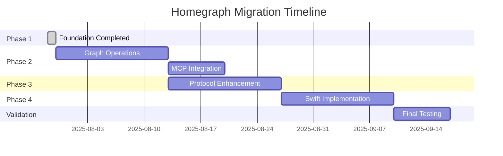
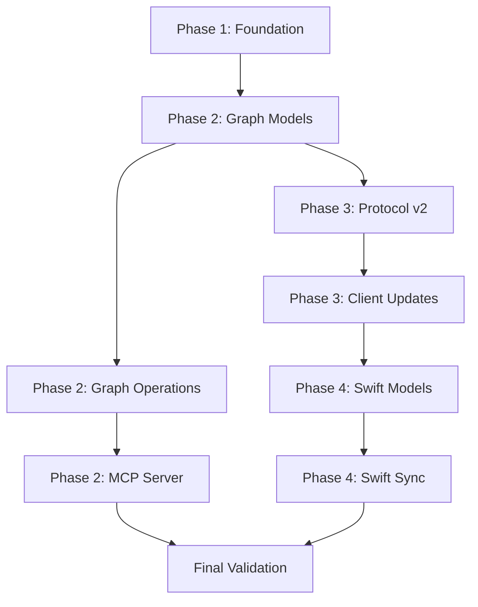

# Comprehensive Migration Timeline with Dependencies

## Executive Summary

The migration from HomeKit-based models to a full knowledge graph architecture will span approximately 8 weeks, divided into 4 major phases. Each phase builds upon the previous, with careful dependency management and validation gates between phases.

## Timeline Overview

## Detailed Phase Timeline

### Phase 1: Foundation (COMPLETED)
**Duration**: Already completed  
**Status**: ✅ Done

Completed items:
- Python package structure (FunkyGibbon, Blowing-off)
- HomeKit-based data models (Inbetweenies)
- Basic sync with last-write-wins
- SQLite storage implementation
- REST API endpoints

### Phase 2: Graph Operations in Python
**Duration**: 2 weeks  
**Start**: Week 1  
**Dependencies**: Phase 1 completion

#### Week 1 (Days 1-5)
**Goal**: Implement graph data models and storage

| Day | Tasks | Deliverables | Team |
|-----|-------|--------------|------|
| 1-2 | • Create Entity and Relationship models • Define enums for types • Implement version tracking | • models/entity.py • models/relationship.py • Version generation logic | Backend |
| 3-4 | • Create migration scripts • Build HomeKit → Graph adapters • Test data migration | • Migration scripts • Adapter layer • Migration tests | Backend |
| 5 | • Integration testing • Performance benchmarking • Documentation | • Test results • Performance report • Updated docs | QA + Backend |

**Validation Gate**: 
- ✓ All existing HomeKit data migrated successfully
- ✓ Zero data loss confirmed
- ✓ API backward compatibility verified

#### Week 2 (Days 6-10)
**Goal**: Implement graph operations and MCP server

| Day | Tasks | Deliverables | Team |
|-----|-------|--------------|------|
| 6-7 | • Build in-memory graph index • Implement path finding • Create search engine | • graph/index.py • graph/search.py • Graph algorithms | Backend |
| 8-9 | • MCP tool definitions • MCP server implementation • API integration | • mcp/tools.py • mcp/server.py • API endpoints | Backend |
| 10 | • End-to-end testing • Performance optimization • Deploy to staging | • E2E test results • Optimized code • Staging deployment | DevOps + QA |

**Validation Gate**:
- ✓ Graph queries < 10ms
- ✓ MCP tools functional
- ✓ Staging environment stable

### Phase 3: Enhanced Inbetweenies Protocol
**Duration**: 2 weeks  
**Start**: Week 3  
**Dependencies**: Phase 2 graph operations

#### Week 3 (Days 11-15)
**Goal**: Protocol enhancement and compatibility

| Day | Tasks | Deliverables | Team |
|-----|-------|--------------|------|
| 11-12 | • Design v2 protocol schema • Implement protocol negotiation • Build v1→v2 adapters | • Protocol spec v2 • Negotiation logic • Adapter layer | Protocol Team |
| 13-14 | • Version management • Conflict resolution • Delta sync engine | • Versioning system • Conflict resolver • Delta calculator | Backend |
| 15 | • Protocol testing • Compatibility testing • Documentation | • Test suite • Compatibility matrix • Protocol docs | QA |

**Validation Gate**:
- ✓ v1 and v2 clients can sync together
- ✓ Conflict resolution working
- ✓ Delta sync reduces bandwidth by >70%

#### Week 4 (Days 16-20)
**Goal**: Client updates and binary sync

| Day | Tasks | Deliverables | Team |
|-----|-------|--------------|------|
| 16-17 | • Update Python client • Implement sync state • Add retry logic | • Enhanced client • State manager • Network resilience | Client Team |
| 18-19 | • Binary content protocol • Chunked transfer • Compression | • Binary sync • Transfer optimization • Storage efficiency | Backend |
| 20 | • Multi-client testing • Stress testing • Deploy updates | • Test results • Performance metrics • Production deploy | QA + DevOps |

**Validation Gate**:
- ✓ Multiple clients sync successfully
- ✓ Binary content sync working
- ✓ Network failure recovery confirmed

### Phase 4: Swift/WildThing Implementation
**Duration**: 2 weeks  
**Start**: Week 5  
**Dependencies**: Phase 3 protocol, Python implementation stable

#### Week 5 (Days 21-25)
**Goal**: Core Swift implementation

| Day | Tasks | Deliverables | Team |
|-----|-------|--------------|------|
| 21-22 | • Swift package setup • Entity models • JSON coding | • Package.swift • Model definitions • Codable support | iOS Team |
| 23-24 | • SQLite storage • Storage protocol • CRUD operations | • Storage layer • Database schema • Storage tests | iOS Team |
| 25 | • HomeKit import • Data conversion • Permission handling | • HomeKit bridge • Import logic • iOS integration | iOS Team |

**Validation Gate**:
- ✓ Swift models match Python
- ✓ Storage layer functional
- ✓ HomeKit import working

#### Week 6 (Days 26-30)
**Goal**: Sync client and platform integration

| Day | Tasks | Deliverables | Team |
|-----|-------|--------------|------|
| 26-27 | • Inbetweenies client • HTTP networking • Sync engine | • Sync client • Network layer • Sync tests | iOS Team |
| 28-29 | • Graph operations • Search implementation • Platform features | • Graph index • Search engine • iOS/macOS features | iOS Team |
| 30 | • Integration testing • App integration • Documentation | • Test results • Sample app • Swift docs | iOS Team + QA |

**Validation Gate**:
- ✓ Swift client syncs with Python server
- ✓ Graph operations working
- ✓ Sample app functional

### Final Validation Phase
**Duration**: 1 week  
**Start**: Week 7  
**Dependencies**: All phases complete

| Day | Tasks | Deliverables | Team |
|-----|-------|--------------|------|
| 31-32 | • End-to-end testing • Cross-platform sync • Performance testing | • Test reports • Performance metrics • Bug fixes | All Teams |
| 33-34 | • User acceptance testing • Documentation review • Training materials | • UAT feedback • Final docs • Training guides | QA + Docs |
| 35 | • Production deployment • Monitoring setup • Go-live | • Production system • Monitoring dashboard • Launch announcement | DevOps |

## Dependency Management

### Critical Path Dependencies

### Parallel Work Streams

1. **Documentation Stream** (Weeks 1-7)
   - API documentation
   - Integration guides
   - Migration guides

2. **Testing Stream** (Weeks 1-7)
   - Unit test development
   - Integration test suites
   - Performance benchmarks

3. **DevOps Stream** (Weeks 2-7)
   - CI/CD pipeline updates
   - Monitoring setup
   - Deployment automation

## Resource Allocation

### Team Assignments

| Team | Phase 2 | Phase 3 | Phase 4 | Validation |
|------|---------|---------|---------|------------|
| Backend (3) | 100% | 50% | 20% | 50% |
| Protocol (2) | 20% | 100% | 20% | 30% |
| iOS (2) | 0% | 20% | 100% | 50% |
| QA (2) | 30% | 30% | 30% | 100% |
| DevOps (1) | 20% | 20% | 20% | 50% |

### External Dependencies

1. **MCP SDK Updates**
   - Monitor for SDK releases
   - No blocking dependencies
   - Can use current version

2. **Swift Package Dependencies**
   - SQLite.swift (stable)
   - Swift Crypto (stable)
   - No blocking issues

3. **Infrastructure**
   - Staging environment ready
   - Production capacity verified
   - Backup systems tested

## Risk Timeline

### High-Risk Periods

1. **Week 1, Day 3-4**: Data migration
   - Risk: Data loss or corruption
   - Mitigation: Extensive backups, validation

2. **Week 3, Day 11-12**: Protocol v2 deployment
   - Risk: Client incompatibility
   - Mitigation: Dual protocol support

3. **Week 5, Day 26-27**: Cross-platform sync
   - Risk: Platform differences
   - Mitigation: Comprehensive testing

### Buffer Time

- Each phase includes 1 day buffer
- Final week is entirely buffer/validation
- Can extend timeline by 1 week if needed

## Success Metrics by Week

### Week 1-2 Metrics
- Entity creation rate: >1000/second
- Graph query time: <10ms
- Memory usage: <100MB for 10k entities
- API compatibility: 100%

### Week 3-4 Metrics
- Sync success rate: >99.9%
- Delta sync efficiency: >70% bandwidth reduction
- Conflict resolution: <100ms
- Protocol compatibility: v1 & v2

### Week 5-6 Metrics
- Swift compile time: <30 seconds
- iOS sync time: <1 second
- HomeKit import: 100% success
- Cross-platform sync: 100% compatible

### Week 7 Metrics
- End-to-end latency: <500ms
- System uptime: >99.9%
- User satisfaction: >4.5/5
- Zero data loss confirmed

## Communication Timeline

### Weekly Updates
- **Monday**: Week kickoff and goals
- **Wednesday**: Progress check-in
- **Friday**: Week summary and blockers

### Phase Gates
- **End of Phase 2**: Go/No-go decision
- **End of Phase 3**: Go/No-go decision
- **End of Phase 4**: Launch readiness review

### Stakeholder Reviews
- **Week 2**: Technical architecture review
- **Week 4**: Protocol compatibility review
- **Week 6**: Platform integration review
- **Week 7**: Launch readiness review

## Rollback Windows

Each phase has specific rollback windows:

| Phase | Rollback Window | Rollback Time | Impact |
|-------|----------------|---------------|--------|
| Phase 2 | 48 hours | <15 minutes | Minimal |
| Phase 3 | 24 hours | <30 minutes | Medium |
| Phase 4 | 72 hours | <15 minutes | iOS only |

## Post-Migration Activities (Week 8+)

1. **Performance Optimization**
   - Query optimization
   - Cache tuning
   - Index optimization

2. **Feature Expansion**
   - Natural language queries
   - Advanced MCP tools
   - Real-time sync

3. **Platform Expansion**
   - watchOS app
   - macOS native app
   - Web interface

## Conclusion

This 7-week migration plan provides a structured approach to evolving The Goodies from HomeKit-based models to a full knowledge graph architecture. With careful dependency management, comprehensive testing, and clear validation gates, we can ensure a successful migration with minimal risk to existing functionality.

Key success factors:
1. Maintain backward compatibility throughout
2. Validate at each phase gate
3. Have rollback plans ready
4. Communicate progress regularly
5. Allow buffer time for unexpected issues